# **Configuring the Administrative panel**
### Glossary

* [Streams](#streams-tab)
* [Reports](#reports-tab)

# **Streams Tab**

To enter the stream editing mode, click on the stream name or create a
new one.

## Streams Config

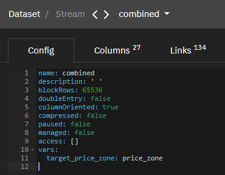

This tab contains general stream options. The settings specified here
take precedence over the general system settings.

Custom Parameters:

-   name: string - stream name.

-   description: string -- stream description.

-   blockRows: int32 -- the number of bytes in the stream data block.
     Blocks are stored independently. The default is 65536 bytes
     (int32)

-   doubleEntry: bool -- the double record maintenance characteristic.
     Used for accounting.

-   columnOriented: bool -- sign of column data storage. True - column
     orientation, false - row orientation

-   paused: bool -- if true, the stream is not automatically updated
     according to its spouts. Explicit push operations/adding data
     manually through appendRecords continues to work.

-   compressed: bool -- if true, then the data is compressed by the LZ4
     algorithm to reduce storage space.

-   access: object\[\] -- allows you to impose data restrictions on
     users:

    -   username: string - name of the user for whom the restrictions
         apply

    -   filter0: string - filter part added to filter0 by "and" for user
         username to all requests for this stream

    -   filter1: string - filter part added to filter1 by "and" for user
         username to all requests for this stream

    -   filter2: string - filter part added to filter2 by "and" for user
         username to all requests for this stream

    -   canWrite: bool - if true, allows the user to add entries to the
         stream

    -   canReset: bool - if true, allows the user to reset the stream

-   vars: object -- stream variables. Is an object whose keys are
     variable names and whose values are default variable values.

## Streams Column

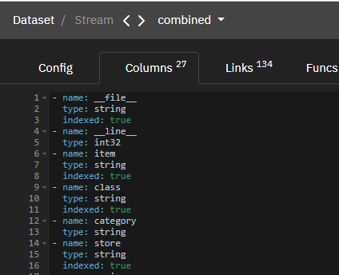

This tab contains stream data structure.

When loading data, they must be ghosted into a column view and be in the
same order in which the columns on this page are declared. Thus, the
order of columns is important when loading data, and their names are
important when reading data. The description of each column is an object
with the following properties:

-   name - column name (string)

-   type - column type (string)

-   indexed - column indexing flag (bool)

-   fulltext - flag that activates the fulltext index for the column
     (bool)

-   synonym - another name for the column. It will not be displayed, but
     it can be accessed (string)

Two service attributes are also available:

● \_\_file\_\_ is automatically filled with the name of the file from
which the data is written to the system (string, indexed)

● \_\_line\_\_ is automatically filled with the line number of the file
from which the data is written to the system (int32)

## Streams Links

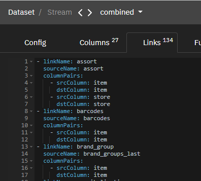
Contains information about the connections of the stream with other
entities: streams or reports (object).

Custom Parameters:

-   linkName: link name (string)

-   sourceName: name of the entity with which the link is created
     (string)

-   columnPairs: list of related columns (object):

     - srcColumn: string - the column in the current stream
     - dstColumn: string - The column in the target entity. The dstColumn
     must be indexed if a stream is specified as sourceName. Both columns
     must be of the same data type.

## Streams Funcs

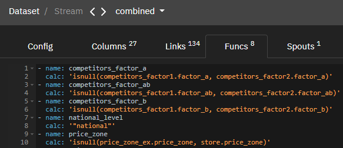

funcs - in this tab, you can create virtual calculated attributes based
on stream attributes using additional functions (object).

Custom Parameters:

-   name: string - column name (string)

-   calc: function formula (string)

-   args: function arguments(string)

*[Important!: The result of Func cannot be referenced in
rules]{.underline}*

Other:

The cast(column, type) function performs type conversion.

Example:

update_date contains the value 2022-01-08 of type date.

cast(update_date, int64) will return the value 20220108 of type int64

The datetime (double) function converts unix time to a number.

Example:

create_time contains unix time in double format: 1662466916688

datetime (create_time ) will output the value 20220906152156 of type
int64

## Streams Spouts

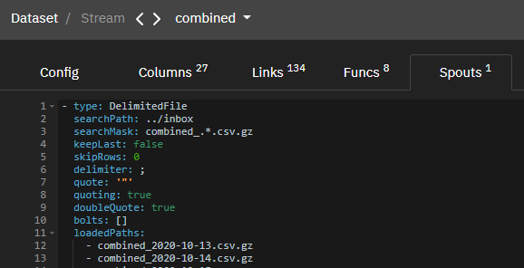

Spouts define data sources for a stream. Streams can receive data via 3
methods:

-   appendRecords - GraphQL API

-   DelimitedFile spout - loading data from files

-   ExternalProcess spout - loading data using an external program

**DelimitedFile spout -- loading data from files**

Spout loads files from a given directory that matches a given mask.

-   type: string = DelimitedFile

-   searchPath: string - path to the directory in which the files are
     searched. The path can be relative to the working directory. The
     path is specified in Linux format.

-   searchMask: string - file name mask as a regular expression
     following syntax defined at
     https://docs.rs/regex/latest/regex/#syntax

-   keepLast: bool - if true, then the stream will only contain the data
     from the last file. The last file is defined as the last file in
     the list of files sorted alphabetically by the file name. This
     parameter is false by default.

-   skipRows: integer - defines a number of rows to skip from the
     beginning of each file. The default value is 0.

-   delimiter: string - column delimiter in the file.

-   quote: string - specifies quotation character for quoted fields. The
     default value is \".

-   quoting: bool - specifies if fields quotation is used in a file. The
     default value is true.

-   doubleQuote: bool - specifies if quotation characters are doubled
     for fields that have quotation characters. Here is an example of a
     double-quoted field: \"Milk \"\"House in the Village\"\"\". The
     default value is true.

-   bolts: string\[\]\[\] - a list of programs that process the input
     before loading it into the stream. The first line of each bolt
     must be a valid Linux executable available in the server
     container. The remaining lines are command parameters. The data
     obtained from the file is transmitted to the first command via
     stdin. Processed data must be sent to stdout. The program can
     write logs to stderr. If a log line starts with the character !,
     such line is considered an important message. Every subsequent
     program receives data via stdin from the previous program. Data
     from the stdout of the last command is added to the stream. The
     default value is\[\].

-   batch: integer - specifies the number of files to process in a
     single dataset synchronization cycle. For a large number of files,
     it is recommended that you set this value to avoid overloading the
     system. The default constraint is not set.

-   loadedPaths: string\[\] - list of files that are loaded to the
     stream.

-   excludedPaths: string\[\] - a list of files that will be excluded
     from loading.

-   parsers: object - paser settings:

-   decimal: string - separator of whole and fractional parts. The
     default value is ..

-   thousands: string - thousands delimiter. The default value is null
     (no thousands delimiter used).

-   dateFormats: string\[\] - date formats without time. When parsing
     date values, the formats are applied in the order in which they
     are defined. Syntax of possible formats:
     https://docs.rs/chrono/0.4.0/chrono/format/strftime/index.html

-   timeFormats: string\[\] - time formats. When parsing time values,
     the formats are applied in the order in which they are defined.
     Syntax of possible formats:
     https://docs.rs/chrono/0.4.0/chrono/format/strftime/index.html

-   datetimeFormats: string\[\] - date formats with time. When parsing
     datetime values, formats are used in the order in which they are
     defined. Syntax of possible formats:
     https://docs.rs/chrono/0.4.0/chrono/format/strftime/index.html

**ExternalProcess spout -- loading data using an external program**

This type of spout allows to load data into a stream using an external
console program that complies with the following protocol:

-   As the first line in **stdin** it receives its configuration encoded
     as a single-line JSON.

-   As the second line in **stdin** it receives the previously stored
     synchronization state encoded as a single-line JSON.

-   As the first list in **stdout** it sends an updated synchronization
     state encoded as a single-line JSON.

-   As the second line in **stdout** it sends a list of row keys to
     remove from a stream encoded as a single-line JSON.

-   All the remaining output in **stdout** will be considered as CSV
     encoded list of new rows to add to a stream.

-   It sends log messages to **stderr**. Important messages start with
     the **"!"** character.

The spout settings are the following:

-   type: string = ExternalProcess

-   config: object - is passed as a JSON string to the called program by
     the first line in stdin.

-   state: object - is passed as a JSON string to the called program by
     the second line in stdin.

-   command: string\[\] - the first line is a valid bash command
     available in the server container. The remaining lines are command
     parameters.

-   skipRows: integer - defines a number of rows to skip from the
     beginning of each file. The default value is 0.

-   delimiter: string - column delimiter in the file.

-   quote: string - specifies quotation character for quoted fields. The
     default value is \".

-   quoting: bool - specifies if fields quotation is used in a file. The
     default value is true.

-   doubleQuote: bool - specifies if quotation characters are doubled
     for fields that have quotation characters. Here is an example of a
     double-quoted field: \"Milk \"\"House in the Village\"\"\". The
     default value is true.

-   bolts: string\[\]\[\] - a list of programs that process the input
     before loading it into the stream. The first line of each bolt
     must be a valid Linux executable available in the server
     container. The remaining lines are command parameters. The data
     obtained from the file is transmitted to the first command via
     stdin. Processed data must be sent to stdout. The program can
     write logs to stderr. If a log line starts with the character !,
     such line is considered an important message. Every subsequent
     program receives data via stdin from the previous program. Data
     from the stdout of the last command is added to the stream. The
     default value is\[\].

-   parsers: object - parser settings:

-   decimal: string - separator of whole and fractional parts. The
     default value is ..

-   thousands: string - thousands delimiter. The default value is null
     (no thousands delimiter used).

-   dateFormats: string\[\] - date formats without time. When parsing
     date values, the formats are applied in the order in which they
     are defined. Syntax of possible formats:
     https://docs.rs/chrono/0.4.0/chrono/format/strftime/index.html

-   timeFormats: string\[\] - time formats. When parsing time values,
     the formats are applied in the order in which they are defined.
     Syntax of possible formats:
     https://docs.rs/chrono/0.4.0/chrono/format/strftime/index.html

-   datetimeFormats: string\[\] - date formats with time. When parsing
     datetime values, formats are used in the order in which they are
     defined. Syntax of possible formats:
    > https://docs.rs/chrono/0.4.0/chrono/format/strftime/index.html

## Streams Files

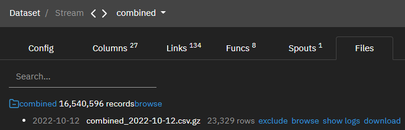

This tab contains a list of files that belong to the stream.

The user has access to a search string by file name.

With each file, the user can perform the following operations:

-   exclude file: exclude

-   browse the contents of the file: browse

-   view file upload error log: show logs

-   download file: download

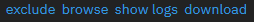

## Streams Records

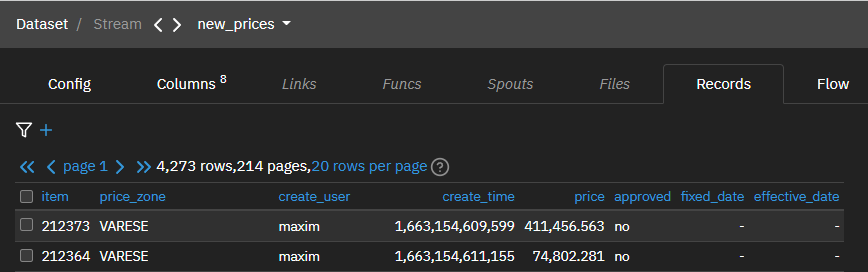

This tab contains the result of downloading stream data, including
historical data.

The following operations are available to the user:

-   Selecting the number of rows to display per page: rows per page

-   Deleting rows point by point, by selecting them manually and using
     the Delete selected rows button

-   Export in csv format with Export data button

-   Import in csv format with the Import data button

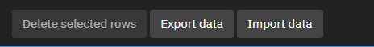

*IMPORTANT!: The basic settings in Spouts may not match the files you
upload. In this case, you need to change the settings or the structure
of the uploaded file. The main condition is that the upload structure
from the file uploaded to the server corresponds to the structure
described in the Columns tab*

*IMPORTANT!: NULL and 0 are displayed the same way.*

#### Streams Flow

### 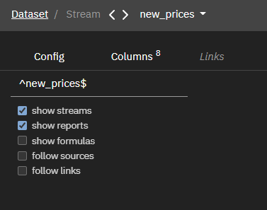

The user can enable and disable the display using the flags on the left:

-   Streams: show streams

-   Reports: show reports

-   Formulas: show formulas

-   Sources. follow sources

-   Links: follow links

# **Reports Tab**

## Reports Config

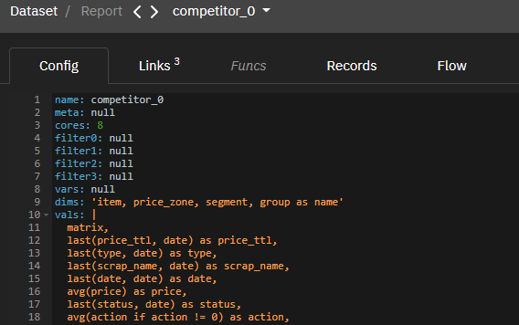

This tab contains the main parameters of the report.

Custom Parameters:

-   name - report name (string)

-   cores - number of cores used to create the report (int32)

-   filter0 - database query filter (filter)

-   filter1 - database query filter (filter)

-   filter2 - database query filter (expression)

-   filter3 - database query filter (expression)

-   vars - list of managed report variables (object)

-   dims - attributes that form the main report key (formulas)

-   vals - additional attributes on which the user can apply aggregate
     functions. In the absence of a function, an arbitrary notation
     (formulas) is taken

IMPORTANT!: vals must have an aggregate function.

In any graphql queries in vals (metrics are also such), aggregates are
required, otherwise, comparisons break.

-   cols - attributes for additional calculations for aggregates, allows
     you to perform additional calculations on them (formulas)

-   sort - index of columns by which the report result is sorted (int32)

-   source - data source for the report (symbol)

-   indexes - indicates which columns are indexed (int32)

-   links - contains information about the links of the stream with
     other entities: streams or reports (object).

Object structure:

-   linkName: link name (string)

-   sourceName: name of the entity to link to (string)

-   columnPairs: list of related columns (object):

    -   srcColumn: string - the column in the current stream

    -   dstColumn: string - the column in the target entity. The
         dstColumn must be indexed if a stream is specified as
         sourceName. Both columns must be of the same data type.

-   funcs - in this block, you can create virtual calculation attributes
     based on stream attributes using additional functions (object).
     Object structure:
    -   name: string - column name (string)
    -   calc: function formula (string)
    -   args: function arguments(string)
-   expire - report lifetime in seconds (double)
-   stored - flag indicating whether the report is stored in the
     database (bool)

## Reports Links

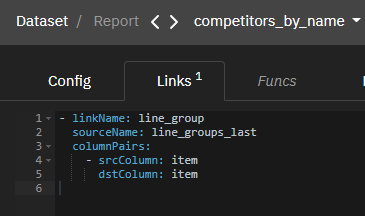

Set up links to other streams and reports. The linked stream/report data
is accessed through the linkName.field1 point. Advertised links cannot
be used in the current report, but can be used in other streams/reports
that use this one. It is an array of objects:

-   linkName: string - link name

-   sourceName: string - name of the stream or report to be linked

-   columnPairs: object\[\] - a list of columns on which to link. Is an
     array of objects:

-   srcColumn: string - column in the current stream

-   dstColumn: string - link stream/report column

## Reports Funcs

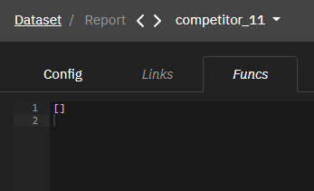

Shows computed columns. Is an array of objects:

-   name: string - column name

-   calc: string - the formula by which the column value is calculated

-   args: string\[\] - arguments of the function

## Reports Records

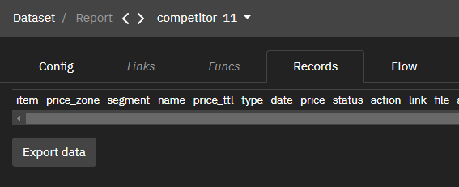

Export Data

## Reports Flow

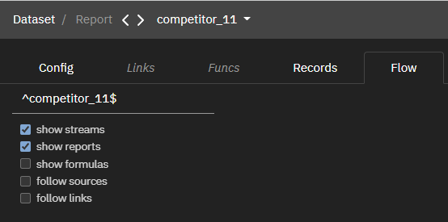

Show relationships between entities in the system.

The user can enable and disable the display using the flags on the left:

-   Streams: show streams

-   Reports: show reports

-   Formulas: show formulas

-   Sources. follow sources

-   Links: follow links

##### Check Appendix for more informations about [Parameters](../parameters/).

<h3>Config tab</h3>
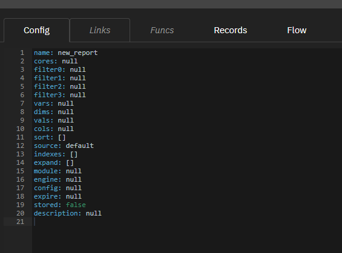

This tab contains general report settings.
The system supports storing reports referenceable by a report name.
Settings in details are available [there](../docs/admin/report/config/)
<h3>Links tab</h3>
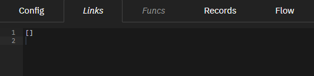

This tab contains report links to other streams and reports. The linked stream/report data is accessed through the linkName.field1 point. Each link is an object with the following properties:
  
- *linkName*: string - link name
- *sourceName*: string - name of the stream/report to be linked
- *columnPairs*: object[] - list of columns to link to:
  - *srcColumn*: string - column in the current stream
  - *dstColumn*: string - column in link stream/report
<h3>Funcs tab</h3>
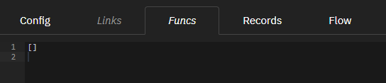

This tab contains report functions. Each function is an object with the following properties:
- *name*: string – column name
- *calc*: string – the formula by which the column value is calculated
- *args*: string[] – formula args
<h3>Records tab</h3>
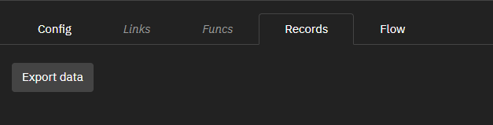

This tab contains information about the content of the report.

The following operations are available:
- Selecting the number of rows to display per page
- Export in csv format with the *Export data* button
<h3>Flow tab</h3>
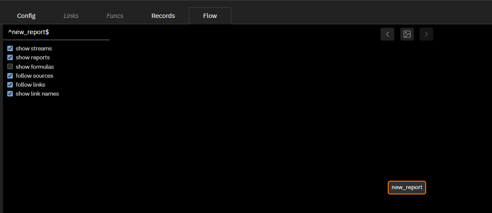

This tab displays the relationships between the current report and the linked entities. A detailed description is available below.

