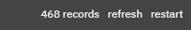
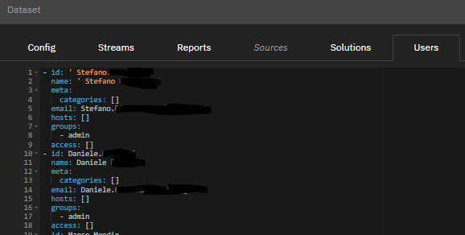

# **Understanding Administration panel**
### Glossary

* [Config Tab](#config-tab)
* [Streams](#streams-tab)
* [Reports](#reports-tab)
* [Users](#users-tab)
* [Sources](#sources-tab)
* [Solutions](#solutions-tab)
* [Flow Tab](#flow-tab)

## **Config Tab**

This tab contains general settings for the server.

Custom Parameters:

-   **refresh** - defines the delay in seconds between stream
     synchronization cycles. streams are synchronized altogether. All
     changes will be posted at the same time. If any of the streams
     were asynchronously changed during synchronization, all changes
     would be rejected.

-   **assets** - specifies global frontend assets that will be prepended
     to all pages. Page code can expect all assets to be loaded before
     executing any custom logic. Typical use cases are to load
     third-party libraries or register a set of custom components.

-   **private** - a flag, if set, disables access for unauthorized users
     (anonymous access).

-   **timezone** - sets the time zone for date & time functions used in
     queries.

### **Streams Tab**

This tab is designed to manage data loading flows into the system. Data
is loaded via streams. Streams represent structured material data. It is
characterized by data loading parameters, data structure, and data
itself.

Stream has a name, a set of columns, and a set of spouts. Spouts are
data sources for a stream. The platform always preserves in its original
form all the data that enters it. The data format can be anything as
long as it can be converted to a column type.

When setting up streams, apache storm terminology is used.

The user has access to the search string by the name of the stream. The
Create stream button allows you to create a new stream. The Delete
stream button allows you to delete a stream.

When clicking on the stream name or creating a new one, the user enters
the stream editing mode. In the stream editing mode, the following tabs
are available to the user:

-   Config
-   Column
-   Spouts
-   Files
-   Records
-   Flow.

In edit mode, the top right shows the number of lines in the stream and
two buttons

-   refresh - refreshes stream data
-   restart - completely reloads the data into the stream

### **Reports Tab**

This tab contains information about reports. A report is an entity that
contains transformed data based on the data existing in the system. The
report is used to aggregate data in streams or other reports. Serves to
implement business logic.

The generated reports can be viewed:

● via the GraphiQL console

● by adding a report as a source for a custom page element.

The user has access to the search string by the name of the report. The
Create report button allows you to create a new report. The Delete
Report button allows you to delete a report. When you click on the name
of a report or create a new one, the user switches to report editing
mode.

In the report editing mode, the following tabs are available to the
user:

-   Config,
-   Records,
-   Flow.

### **Users tab**

This tab contains a list of users, their accesses, and roles. Only the
administrators have the right to configure and save changes.

The description of each user is an object:

-   id: string - username.
-   name:string - name of the user.
-   email: string - email of the user.
-   meta: object - additional restrictions for the user:
    -   categories: string\[\] - list of categories available to the
         user. If not specified or empty - all categories are
         available.
-   groups: string\[\] - a list of the groups the user is a member of.
     Two groups are currently available:
    -   admin
    -   category manager.
-   access: object\[\] - restricting access to streams
    -   stream: string - stream name
    -   filter0: string - filter part added to filter0 by "and" for user
         username to all requests for this stream
    -   filter1: string - filter part added to filter1 by "and" for user
         username to all requests for this stream
    -   filter2: string - filter part added to filter2 by "and" for user
         username to all requests for this stream
    -   canWrite: bool - if true, allows the user to add entries to the
         stream
    -   canReset: bool - if true, allows the user to reset the stream.

### **Sources Tab**

This tab contains information about external connections to data sources
for loading, such as ODBC, kafka, etc. These connections can be used as
a source for a stream (Streams -\> Spouts).

### **Solutions Tab**

This tab contains a list of system solutions. A solution is a set of
metrics that can be used when creating the main report. Config2 page is
a visualization of the "default" solution.

### **Flow Tab**

This tab displays relationships between entities in the system. The user
can search by entity name. The user can exclude an entity using the
Exclude line.

The user can export links as png images using the image button in the
middle on top of flow chart.

The user can enable and disable the display using the flags on the left:

-   Streams: show streams
-   Reports: show reports
-   Formulas: show formulas
-   Links: follow links
-   Link names: show link names

##### More about [admin configuration](../config/).
