# **Understanding Administration panel**
### Glossary

* [Config Tab](#config-tab)
* [Streams](#streams-tab)
* [Reports](#reports-tab)
* [Users](#users-tab)
* [Sources](#sources-tab)
* [Solutions](#solutions-tab)
* [Flow Tab](#flow-tab)

<!--# Admin-->
<h1>Admin UI</h1>
The admin UI is an interface designed to configure general system settings, integration flows, internal reports, configurations, and the role model.
To access the administration panel, you may enter [https://hostname/admin](/admin) in the address bar.
The admin UI looks as follow:

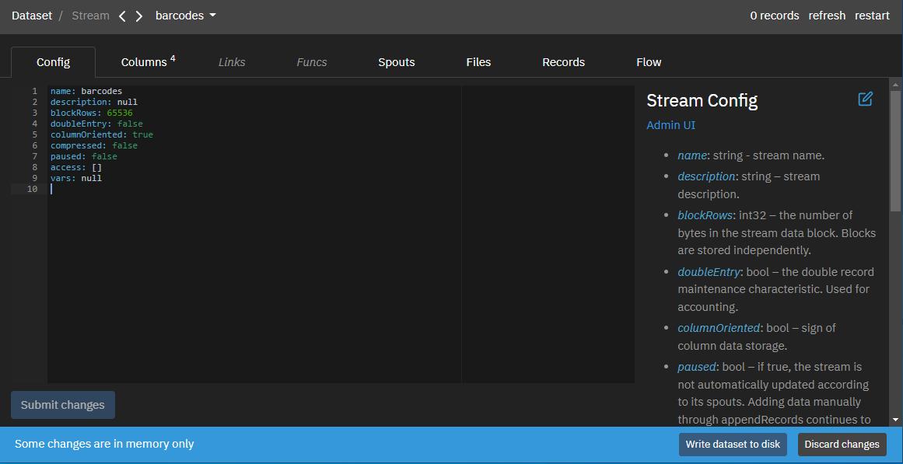

Help information is located on the right side. It can be edited through the page editor interface.
The *Reload button* at the top right reloads the data in the system.
The *Submit Changes* button at the bottom left saves the changes on the page.
The warning *Some changes are in memory only* occurs when there is a desynchronization between the data in the administration panel and the database. The *Write dataset to disk* and *Discard changes* buttons allow you to write data to the database or discard it, respectively.
You can also switch between the following tabs:
- Config
- Streams
- Reports
- Sources
- Solutions
- Users
- Flow
<h2>Config tab</h2> 
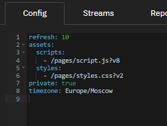

This tab contains general server settings.
Settings in details are available [there](../../admin)

## **Config Tab**

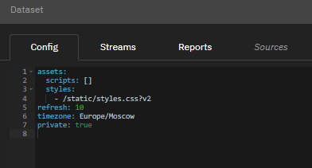

This tab contains general settings for the server.

Custom Parameters:

-   **refresh** - defines the delay in seconds between stream
     synchronization cycles. streams are synchronized altogether. All
     changes will be posted at the same time. If any of the streams
     were asynchronously changed during synchronization, all changes
     would be rejected.

-   **assets** - specifies global frontend assets that will be prepended
     to all pages. Page code can expect all assets to be loaded before
     executing any custom logic. Typical use cases are to load
     third-party libraries or register a set of custom components.

-   **private** - a flag, if set, disables access for unauthorized users
     (anonymous access).

-   **timezone** - sets the time zone for date & time functions used in
     queries.

<h2>Streams tab</h2> 
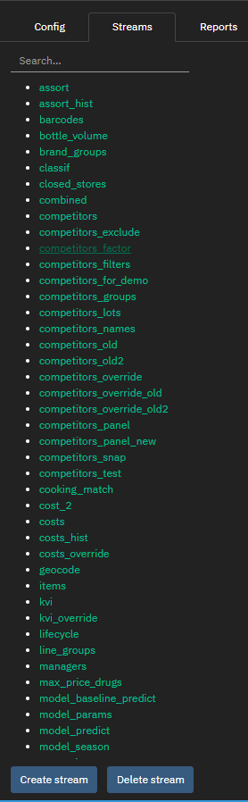

This tab is designed to manage data loading flows into the system. Data
is loaded via streams. Streams represent structured material data. It is
characterized by data loading parameters, data structure, and data
itself.

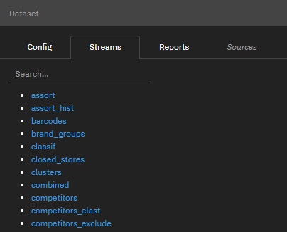

Stream has a name, a set of columns, and a set of spouts. Spouts are
data sources for a stream. The platform always preserves in its original
form all the data that enters it. The data format can be anything as
long as it can be converted to a column type.

The physical representation of a stream is a set of content addressable flat chunks by default stored in the data/objects folder and mapped to the system memory. Each chunk holds up to 65,536 rows. Chunk layout can be columnar or row-oriented depending on the stream settings. Besides actual data, each chunk holds indexes for indexed columns. Each chunk represents an atomic job in the map-reduce pipeline.

When setting up streams, apache storm terminology is used.

The user has access to the search string by the name of the stream. The
Create stream button allows you to create a new stream. The Delete
stream button allows you to delete a stream.

When clicking on the stream name or creating a new one, the user enters
the stream editing mode. In the stream editing mode, the following tabs
are available to the user:

-   Config
-   Column
-   Spouts
-   Files
-   Records
-   Flow.

In edit mode the amount of records in stream and two buttons at the top right are shown:

-   refresh - refreshes stream data
-   restart - complete reload of stream data

You can use search field to find stream.
The *Create stream* button allows you to create a new stream.
The *Delete stream* button allows you to delete a stream.

<h2>Reports tab</h2> 
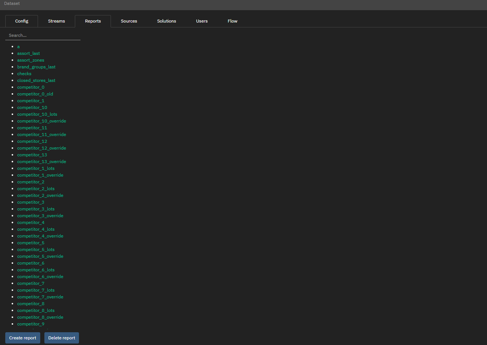

This tab contains information about reports. A report is an entity that
contains transformed data based on the data existing in the system. The
report is used to aggregate data in streams or other reports. Serves to
implement business logic.

The generated reports can be viewed:

● via the GraphiQL console

● by adding a report as a source for a custom page element.

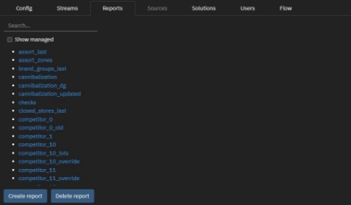

You have access to the search field, it supports regular expressions.

The *Create report* button allows you to create a new report.

The *Delete report* button allows you to delete a report.

When you click on the report name or create a new one, the user switches to the report edit mode.

In the report editing mode, the following tabs are available to the
user:

-   Config,
-   Records,
-   Flow.

<h2> Users tab </h2> 
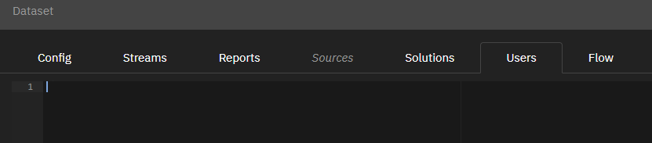

This tab contains a list of users, their accesses, and roles. Only the
administrators have the right to configure and save changes.

The description of each user is an object:

* *id*: string - username.

* *name*:string - name of the user.

* *email*: string - email of the user.

* *meta*: object - additional restrictions for the user:
  - *categories*: string[] - list of categories that are available to the user If not specified or empty - all categories are available.
 
* *groups*: string[] - a list of the groups the user is a member of. Two groups are currently available: admin, category-manager.

* *access*: object[] - restricting access to streams
  - *stream*: string - stream name
  - *filter0*: string - filter part added to filter0 by "and" for user *username* to all requests for this stream
  - *filter1*: string - filter part added to filter1 by "and" for user *username* to all requests for this stream
  - *filter2*: string - filter part added to filter2 by "and" for user *username* to all requests for this stream
  - *canWrite*: bool - if true, allows the user to add entries to the stream
  - *canReset*: bool - if true, allows the user to reset the stream.

### **Sources Tab**

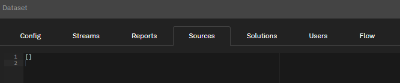

This tab contains information about external connections to data sources
for loading, such as ODBC, kafka, etc. These connections can be used as
a source for a stream (Streams -\> Spouts).

### **Solutions Tab**

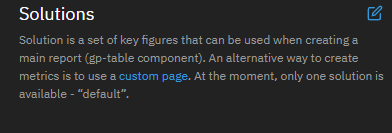

This tab contains a list of system solutions. A solution is a set of
metrics that can be used when creating the main report. Config2 page is
a visualization of the "default" solution.

<h2>Flow tab </h2> 
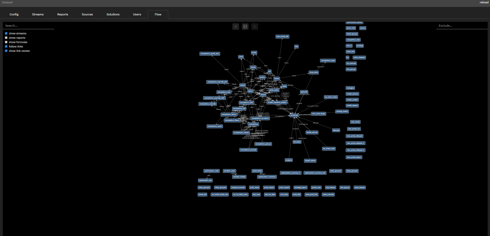

This tab displays relationships between entities in the system.
You can search by entity name via *Search* field.
You can exclude an entity via the *Exclude* field.
You can export links as png images.
You can choose displayed entities via the flags on the left:

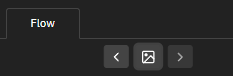

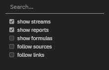

The user can enable and disable the display using the flags on the left:

-   Streams: show streams
-   Reports: show reports
-   Formulas: show formulas
-   Links: follow links
-   Link names: show link names

##### More about [admin configuration](../config/).

