## Glossary

* [Design mode](#preconfigured-pages)
* [Users page](#users-page)
* [Config2 page](#config2-page)
* [GraphQL](#graphiql-console)
* [Admin page](#administrative-ui-guide)

# Preconfigured pages

GoalProfit has a web interface for users to work with the application.
It is a set of pre-configured pages with static addresses and
user-created pages. The root page for custom pages is the
**https://*hostname.goalprofit.com/pages/***. List of preconfigured
pages:
-   pages
-   pages/config2
-   pages/users
-   admin
-   graphiQL

# Design mode

User-created pages are created blank by default. If, after creation, the
content of the page is not edited, then it is not saved in the system.
For more information about user-created pages, check the [User
guide](https://github.com/GoalProfit/gp-internal-docs/blob/main/user_guide/template.md).

In the interface in the upper right corner, a drop-down menu is
available with the following items:

-   design mode - enables developer mode, and allows you to edit page
     content online.

-   dark theme - enable dark theme.

-   translation - Enables localization if it is installed on the
     instance. The default language is English.

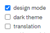

Seven tabs become available in **design mode**:

-   Template - contains page layout
-   Elements - contains parameters of the page and its elements
-   Sources - reference information on available sources
-   Assets - contains a registry of additional files for the page
-   Versions - list previous versions of this page
-   Sitemap - list of all pages
-   Variables - list of all variables being used

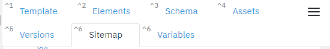

## **Template tab**

This tab is where the page layout is configured. When working with the
page, the WYSIWYG principle is used - what you see is what you get (all
changes in the layout and elements are immediately transferred to the
page).

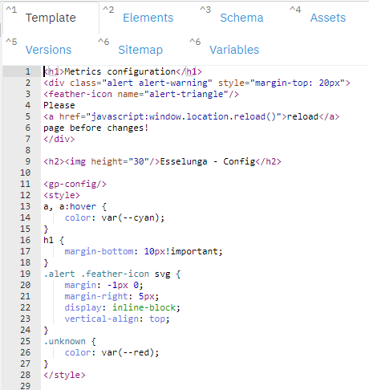

When setting up the page layout, *html / markdown* layout is used with
the ability to use the expanding functionality of the handlebars
templates, *lodash* libraries. The system allows you to add special
visual elements during layout customization. There are 3 groups of
elements:

-   Elements based on the library https://dc-js.github.io/dc.js/
-   Elements based on the library https://zoomcharts.com/en/
-   Customized elements from the vendor.

Elements are used to create additional complex objects on the page (for
example, graphs, charts, and custom tables).

The parameters of the created elements are written on the Elements tab.

## **Elements tab**

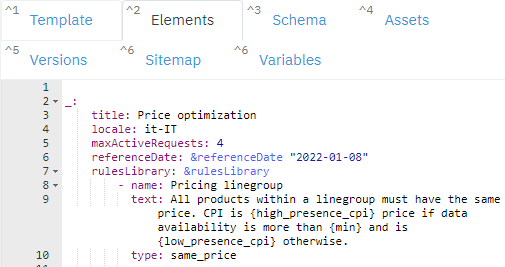

This tab defines the parameters of the page and the elements it
contains.

Each element makes a GraphQL query to the backend, displaying its
result. It can be viewed through the browser console.

All components that work with the same stream use the same information
context. When data is truncated in one component, the same happens to
other components. This context can be managed using groups.

To create an element on the Template tab, use the following syntax:

\<element id=\"element_name\"/\>

on the Elements tab:

-   *element name:*

-   *parameter 1*

-   *parameter 2*

-   *...*

Custom page settings:

-   title: parameter responsible for the title of the tab.

-   locale: parameter responsible for localization.

-   maxActiveRequests: The maximum number of active requests

**Known elements:**

You can check the list of know elements *[here.]{.underline}*

## **Sources tab (Schema)**

This tab contains a list of system sources:

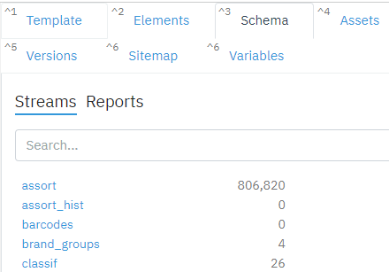

If a description is specified in the Config tab of the source, it will
be displayed below it.

When opening a source, the attribute composition with data types is
displayed:

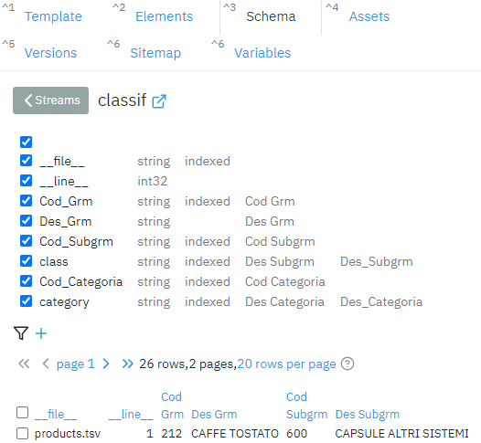

Attribute composition of a stream

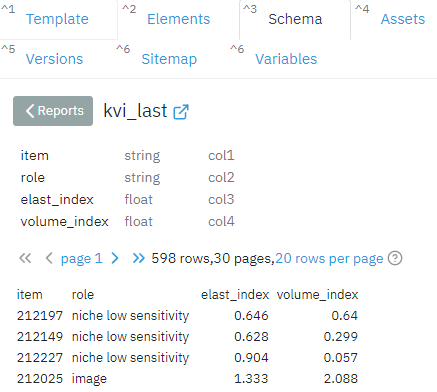

Attribute composition of a report

## **Assets tab**

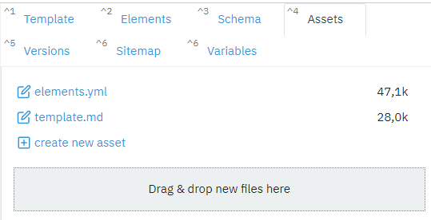

This tab is where additional files are loaded to create pages. You can
upload pictures, gifs, configurations, etc.

-   The root is /pages.

-   Assets for each page are different.

-   You cannot upload a file to a blank page.

-   To link to an asset on another page, you need to specify its
     address:

    >   ./\<asset page\>/\<asset name\>

-   Assets are stored in a folder on the server
    > /olap-rust/data/pages/\<page name\>

## **Sitemap tab**

A Sitemap is a list of pages of a site within a domain.

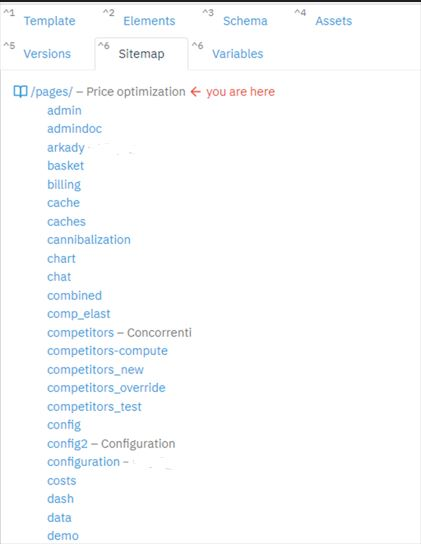

## **Versions tab**

List of all previous versions of the page

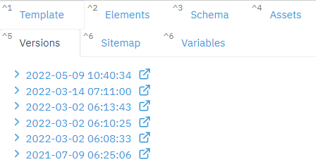

## **Variables tab**

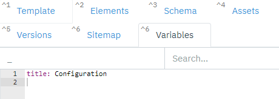

In this tab, you can keep Variables in quick access. Search is
available.

# Users Page

This page contains the list of all authorized users on the server. The
page is accessible through
**https://hostname.goalprofit.com/pages/users**

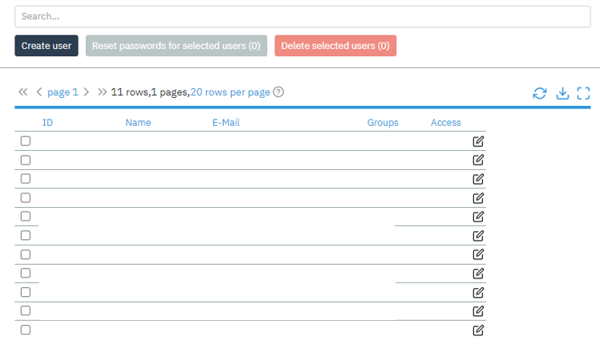

The user has access to the search string by name of the user

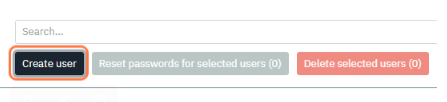

You can create a user by clicking the "Create user" button. If you want
to edit the information or restrict access to certain files & streams,
click on the edit icon on the right side from the user name row.

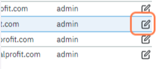

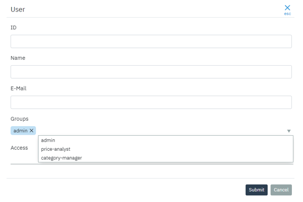

Groups describe the role of members of that group and define what
objects and operations can be accessed and performed:

-   Admin: all the rights including configuration permissions

-   Price analyst: all the rights except configuration

-   Category manager: access to certain streams can be restricted via
     filters

You can download the list of users into csv file format.

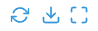

# Config2 Page

This page contains metrics configurations being used currently. The
Setting section describes your location and the currency being used: IT
for Italy and EUR for euros respectively.

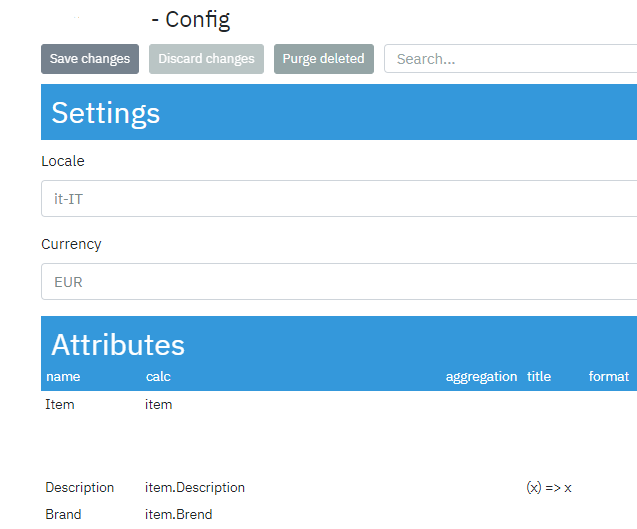

The user has access to a search string by name.

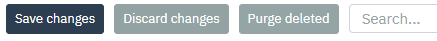

There are 5 sections on config2 page:

-   Attributes: Characteristics of data, such as the size and color of
     products.

-   Metrics: Aggregated report indicators such as sales unit/unit cost

-   Formulas: Formulas used to calculate report indicators

-   Timeframes: Used for report metrics

-   Formats: Attributes and Metrics Output Format

To add a new metric/attribute, below the table click on Add row button.

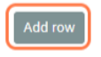

**Important!**: Reload the page after the changes.

For more detailed information about attributes & metrics, check the
Appendix at end of this document.

# GraphiQL console

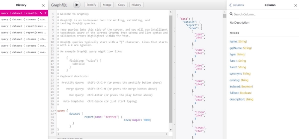

The console is available at
**https://hostname.goalprofit.com/graphiql**. The console is an
interface of the client built into the graphql system (graphiql), which
allows you to generate manual requests to the system. The frontend
communicates with the backend with similar requests, including when
updating settings in the administration panel. If you wish, you can copy
the request from the frontend and see its result here.

The console contains four sections:

-   History - history of previous requests (can be disabled, see below).
-   Code section - the request code is written here.
-   Result section - query result will be displayed here.
-   Reference tab - here you can see the structure of functions and
     available data with detailed information.

The following buttons are also available on the top bar:

-   Button ➤ displays the query result.
-   The Prettify button turns on the script standardization mode
-   The Merge button merges the request code.
-   The Copy button copies the request code.
-   The History button opens/closes the history tab.

Check out [GraphQL API documentation](../../../docs/graphql/)
for more information about API endpoint & sample queries.

# **Administrative UI**

The admin page was designed to configure general system settings,
integration flows, internal reports, configurations, and role models.

To access the administration panel, type
[**https://hostname.goalprofit.com/admin**](../../../../admin) in the address bar.

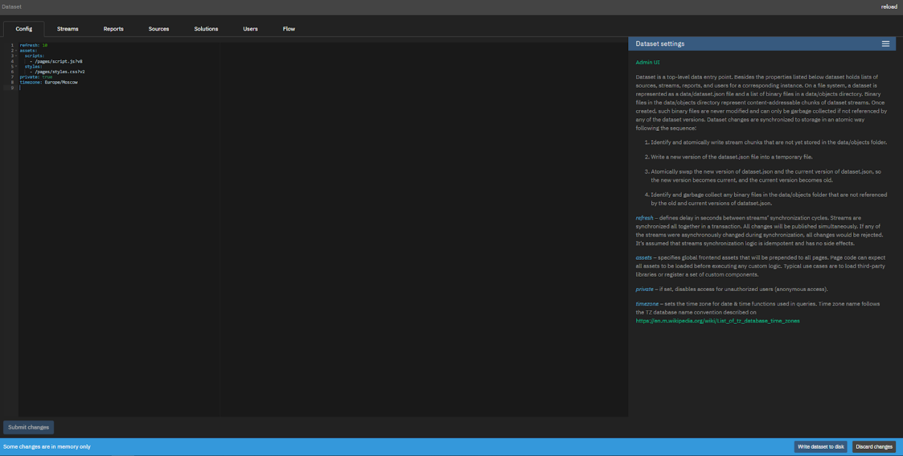

Help information is located on the right side. It can be edited through
the page editor interface.

The Reload button at the top right reloads the data in the system.

The Submit Changes button at the bottom left saves the changes on the
page.

**The warning**: Some changes in memory only occurs when
there is a desynchronization between the data in the administration
panel and the database. The Write dataset to disk and Discard changes
buttons allow you to write data to the database or discard it,
respectively.

The user can switch between the following tabs:

-   Config
-   Streams
-   Reports
-   Sources
-   Solutions
-   Users
-   Flow

##### More about [admin page](../admin/). 
