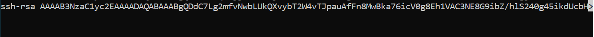
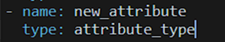

## First Time Walktrough

**How to add a new user to access the server**

-   To create a key, enter the following command into the console:

    -   Windows: ssh-keygen

    -   Unix: ssh-keygen -t rsa

-   The following will be output to the console:

    -   Enter file in which to save the key (/home/user/.ssh/id_rsa):

-   Press enter

-   Next, the system will prompt you to enter a passphrase for
     additional protection of the SSH connection:

    -   Enter passphrase (empty for no passphrase):

-   Press enter twice

-   After that, the key will be created, it can be found in

    -   Windows: C:\\Users\\your_username/.ssh/id_rsa.pub

    -   Unix: /home/user/.ssh/id_rsa.pub

-   The contents of the file must be added to the end of the
     /root/.ssh/authorized_keys file on the server

After that, the server will be available via ssh.

**How to get on the server**

To get to the server, you need to enter the command ssh
root@79.143.24.133

**Adding a user to the system**

To create a new local user, you need to enter the command in the
terminal after connecting to the server:

*htpasswd -bB /data/customer/ola-rust/.htpasswd \<username\>
\<password\>*

After creating a local user, it must be added to the system in the
*/admin#/dataset/users* tab. Example for adding a user with
administrator rights:

You need to load data into the system through streams. Copy your files
in csv UTF-8 or xlsx format into /gp/retail directory on the server. Gz
compression is also available.

Files should be as follows:

-   items: items.csv contains a list of items\
    > attribute set:\
    > item (string)\
    > item_description (string)\
    > class (string)

-   stores: stores.csv contains a list of stores\
    > attribute set:\
    > store (string)\
    > store_adress (string)\
    > store_open (date)\
    > store_close (date)\
    > matrix (string)\
    > price_zone (string)

-   classif: classif.csv contains items hierarchy (four levels by
    > default)\
    > attribute set:\
    > group (string)\
    > category (string)\
    > subcategory (string)\
    > class (string)

-   promo: promo.csv contains a list of promo prices\
    > attribute set:\
    > item (string)\
    > store (string)\
    > promo_price (float)\
    > fixed_price (float)\
    > promo_type (string)

-   prices: prices.csv contains a list of regular prices\
    > attribute set:\
    > item (string)\
    > store (string)\
    > price (float)

-   costs: costs.csv contains a list of costs\
    > attribute set:\
    > item (string)\
    > store (string)\
    > base_price (float)

-   assort: assort.csv contains a matrix of active item-store pairs\
    > attribute set:\
    > item (string)\
    > store (string)\
    > matrix (string) 1 if pair is active

-   zone_price: zones.csv contains a list of zone prices\
    > attribute set:\
    > item (string)\
    > matrix (string)\
    > price (float)

Any number of optional attributes (string, int8, int16, int32, int64,
double, json float, date, time, datetime types) can be added as follow:

-   Go to
    > *https://hostname/admin/dataset/streams/\*\*\*stream_name\*\*\*/columns*

-   Add your attributes:

**Make combined**

You now need to make a combined file. Go to /gp/retail directory on the
server and enter the command in the terminal console:

> *./retail combine 'YYYY-MM-DD'--reload*

This will provide you with *combined_YYYY-MM-DD.csv.gz* file, that will
be automatically loaded in the system.
