# Documentation

Welcome to the administrative guide for our Digital Wave platform! 
This guide is designed to help you navigate and use the various features and functions available in the panel.

## Glossary

* [Navigating the basic interface](interface/)
* [Understanding Administration panel](admin/)
* [Configuring the Administrative panel](config/)
* [First Time Walktrough](quick_guide/)
* [Appendix: Attributes, Metrics, Formulas, Timeframes](parameters/)

We hope this guide has been helpful in getting you started with the administrative panel for our Digital Wave platform. If you have any questions or need further assistance, please don't hesitate to contact our support team.


<!--# Admin-->
<h1>Admin UI</h1>
The admin UI is an interface designed to configure general system settings, integration flows, internal reports, configurations, and the role model.
To access the administration panel, you may enter [https://hostname/admin](/admin) in the address bar.
The admin UI looks as follow:


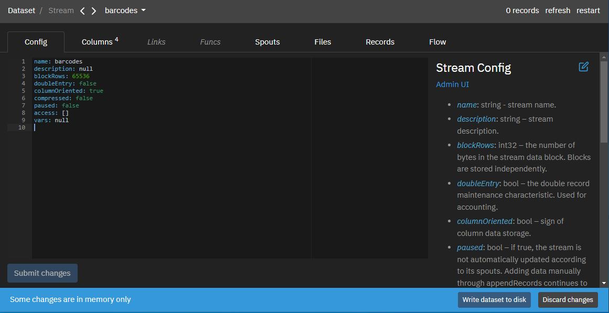

Help information is located on the right side. It can be edited through the page editor interface.
The *Reload button* at the top right reloads the data in the system.
The *Submit Changes* button at the bottom left saves the changes on the page.
The warning *Some changes are in memory only* occurs when there is a desynchronization between the data in the administration panel and the database. The *Write dataset to disk* and *Discard changes* buttons allow you to write data to the database or discard it, respectively.
You can also switch between the following tabs:
- Config
- Streams
- Reports
- Sources
- Solutions
- Users
- Flow
<h2>Config tab</h2> 
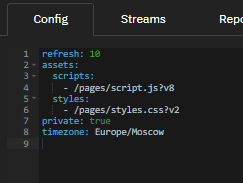

This tab contains general server settings.
Settings in details are available [there](../../admin)
<h2>Streams tab</h2> 
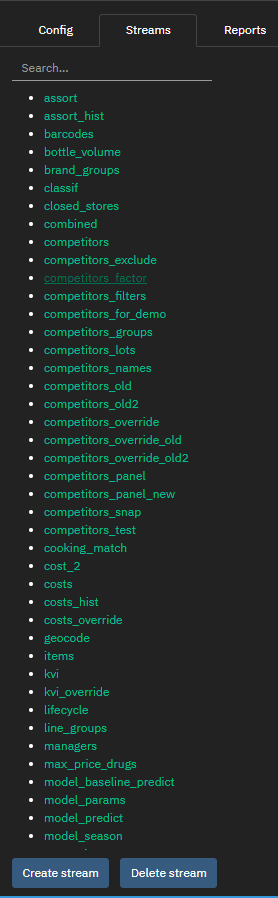

This tab can be used to load data into system through streams. Streams represent structured material data. Stream has a name, a set of columns and a set of spouts. Spouts are data sources for a stream. The physical representation of a stream is a set of content addressable flat chunks by default stored in the data/objects folder and mapped to the system memory. Each chunk holds up to 65,536 rows. Chunk layout can be columnar or row-oriented depending on the stream settings. Besides actual data, each chunk holds indexes for indexed columns. Each chunk represents an atomic job in the map-reduce pipeline.
You can use search field to find stream.
The *Create stream* button allows you to create a new stream.
The *Delete stream* button allows you to delete a stream.
When you click on the stream name or create a new one, you enter the stream edit mode.
In the stream edit mode, the following tabs are available:
- Config
- Columns
- Spouts
- Files
- Records
- Flow

In edit mode the amount of records in stream and two buttons at the top right are shown:

- refresh - refresh of stream data
- restart - complete reload of stream data

<h3>Config tab</h3> 
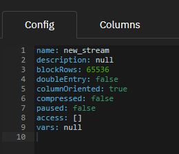

This tab contains general stream settings. Settings in details are available [there](../docs/admin/stream/config/)

<h3> Columns tab</h3>
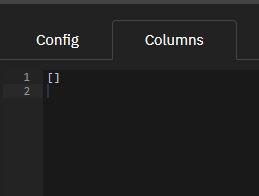
This tab contains stream data structure. Here is a list of columns that will be stored in the stream. When loading data, they must be ghosted into a column view and be in the same order in which the columns on this page are declared. Thus, the order of columns is important when loading data and their names are important when reading data. The description of each column is an object with the following properties:
* *name*: string - column name.
* *type*: string - column type. Only the following data types are supported:
  - *bool* – boolean value
  - *int8* – one-byte signed integer
  - *int16* – two-byte signed integer
  - *int32* – four-byte signed integer
  - *int64* – eight-byte signed integer
  - *float* – single-precision floating-point number
  - *double* – double-precision floating-point number
  - *date* – YYYYmmdd - date without time
  - *time* – HHMMSS - time without date
  - *datetime* – YYYYmmddHHMMSS - date with time
  - *string* – string value
  - *json* – JSON value
* *synonym*: string - an optional alternative name of the field.
* *indexed*: bool - an index will be created for a column, false by default.
* *fulltext*: bool - a full-text index will be created for a column, false by default.
* *description*: string - optional column description.

Two special columns can be defined:

```yaml
- name: __file__
  type: string
  indexed: true
- name: __line__
  type: int32
```

*\_\_file__* is automatically populated with the name of the file from which the record was loaded.
*\_\_line__* is automatically populated with the line number in the file from which the record was loaded.
<h3>Links tab</h3>
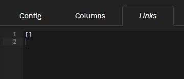

This tab contains stream links to other streams and reports. The linked stream/report data is accessed through the linkName.field1 point. Each link is an object with the following properties:
  
- *linkName*: string - link name
- *sourceName*: string - name of the stream/report to be linked
- *columnPairs*: object[] - list of columns to link to:
  - *srcColumn*: string - column in the current stream
  - *dstColumn*: string - column in link stream/report
<h3>Funcs tab</h3>
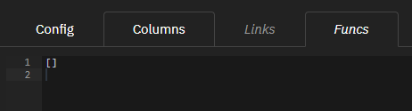

This tab contains stream functions. Each function is an object with the following properties:
- *name*: string – column name
- *calc*: string – the formula by which the column value is calculated
- *args*: string[] – formula args
<h3>Spouts tab</h3>
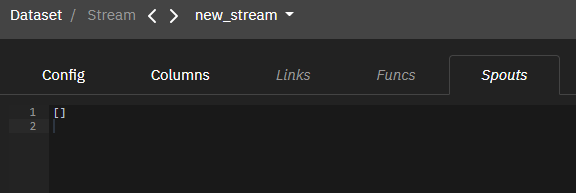

This tab contains stream spouts. Spouts define data sources for a stream. Streams with not spouts still can receive data via appendRecords GraphQL API
Spout loads files from a given directory that matches a given mask.
Settings in details are available [there](../docs/admin/stream/spouts/)
<h3>Files tab</h3>
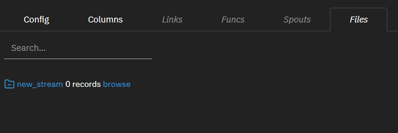

This tab containsl ist of files that belong to the stream.
*The Search field* is used to filter files by name mask. Supports regular expressions.
Below the search field is the number of entries in the stream and the _browse_ link, with which you can view the contents of the entire stream.
Below are all files that are related to this stream. The file list has the following columns:
- File date (taken from file name as substring YYYYMMDD).
- Filename.
- The number of lines loaded from this file, or a "skipped" state indicating that the file was skipped because it is not the last (makes sense if keepLast = true).
- The _exclude_ link, which allows you to exclude a file from the stream and remove entries downloaded from this file from it.
- Link _include_, which allows you to include the file in the stream and download records from it (if the file was excluded earlier).
- A _delete_ reference that allows you to delete a file from the vault (if it was previously excluded).
- The _browse_ link, which allows you to view all records loaded from this file.
- Link _show logs_, which allows you to view the download log if the output in stderr is used in the bolts of the stream.
- Link _download_, which allows you to download the file to your local computer.
<h3>Records tab</h3>
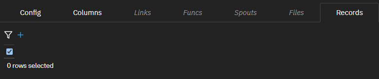

This tab contains the result of loaded stream data, including historical data.
The following operations are available to the user:
- Selecting the number of rows to display per page
- Deleting rows point by point, by selecting them manually and using the Delete selected rows button
- Export in csv format with the Export data button
- Import in csv format with the Import data button
<h3>Flow tab</h3>
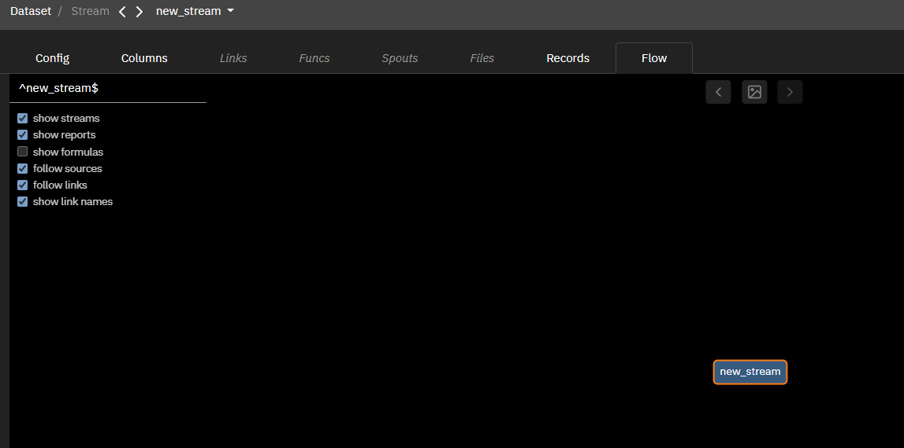
This tab displays the relationships between the current stream and the linked entities. A detailed description is available below. 
<h2>Reports tab</h2> 
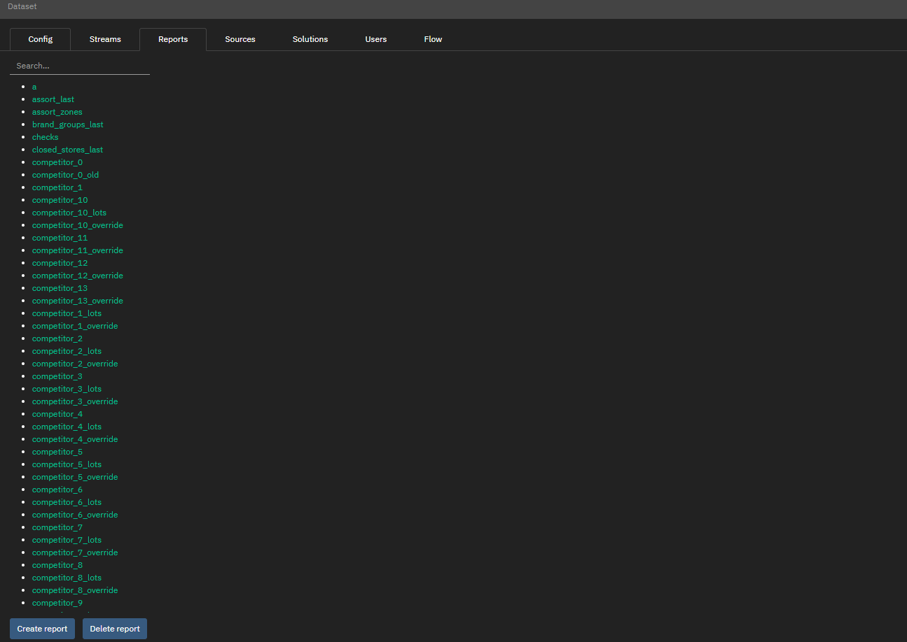

This tab contains reports. A report is an entity that contains transformed data based on the data existing in the system. You can use them to implement business logic.
Reports can be viewed:

- via GraphiQL console
- by adding a report as a source for a custom page element.

You have access to the search field, it supports regular expressions.

The *Create report* button allows you to create a new report.

The *Delete report* button allows you to delete a report.

When you click on the report name or create a new one, the user switches to the report edit mode.

In the report edit mode, the following tabs are available to the user: 
- Config
- Records
- Flow
<h3>Config tab</h3>
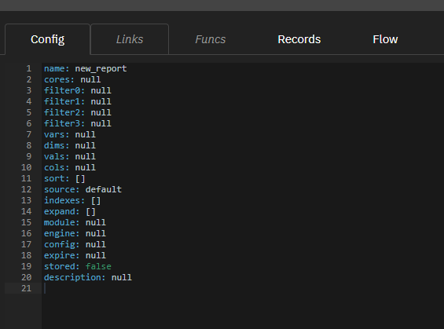

This tab contains general report settings.
The system supports storing reports referenceable by a report name.
Settings in details are available [there](../docs/admin/report/config/)
<h3>Links tab</h3>
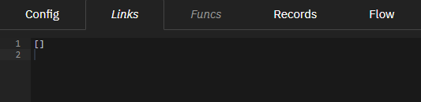

This tab contains report links to other streams and reports. The linked stream/report data is accessed through the linkName.field1 point. Each link is an object with the following properties:
  
- *linkName*: string - link name
- *sourceName*: string - name of the stream/report to be linked
- *columnPairs*: object[] - list of columns to link to:
  - *srcColumn*: string - column in the current stream
  - *dstColumn*: string - column in link stream/report
<h3>Funcs tab</h3>
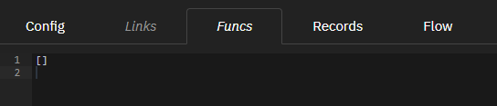

This tab contains report functions. Each function is an object with the following properties:
- *name*: string – column name
- *calc*: string – the formula by which the column value is calculated
- *args*: string[] – formula args
<h3>Records tab</h3>
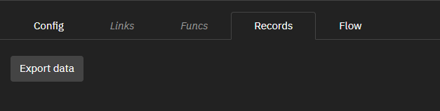

This tab contains information about the content of the report.

The following operations are available:
- Selecting the number of rows to display per page
- Export in csv format with the *Export data* button
<h3>Flow tab</h3>
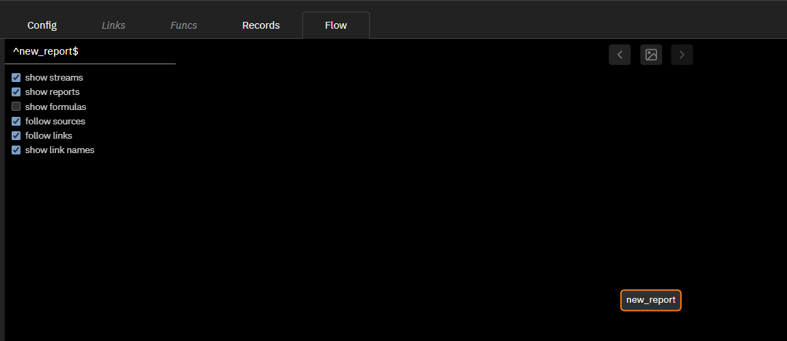

This tab displays the relationships between the current report and the linked entities. A detailed description is available below.
<h2> Sources tab </h2>
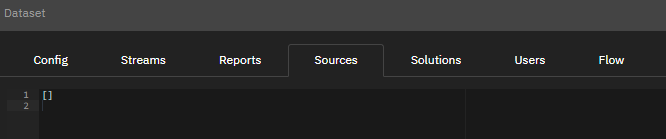

This tab contains information about external connections to download data sources such as ODBC, kafka, etc. These connections can be used as a source for a stream (on the spouts tab).
<h2> Solutions tab </h2> 
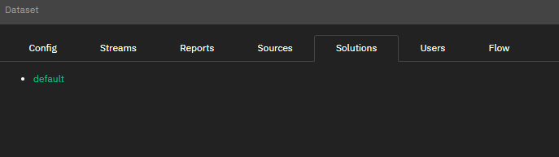

This tab contains solutions of the server. Solution is a set of key figures that can be used when creating a main report (gp-table component). Only one solution is available at the moment - "default".
<h2> Users tab </h2> 
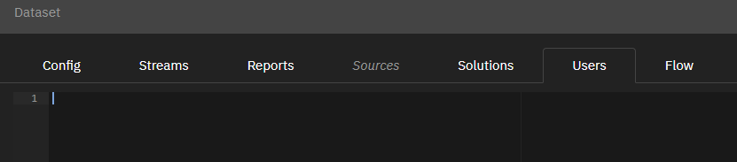

This tab contains list of system users with the ability to configure access rights

The description of each user is an object:

* *id*: string - username.

* *name*:string - name of the user.

* *email*: string - email of the user.

* *meta*: object - additional restrictions for the user:
  - *categories*: string[] - list of categories that are available to the user If not specified or empty - all categories are available.
 
* *groups*: string[] - a list of the groups the user is a member of. Two groups are currently available: admin, category-manager.

* *access*: object[] - restricting access to streams
  - *stream*: string - stream name
  - *filter0*: string - filter part added to filter0 by "and" for user *username* to all requests for this stream
  - *filter1*: string - filter part added to filter1 by "and" for user *username* to all requests for this stream
  - *filter2*: string - filter part added to filter2 by "and" for user *username* to all requests for this stream
  - *canWrite*: bool - if true, allows the user to add entries to the stream
  - *canReset*: bool - if true, allows the user to reset the stream.
<h2>Flow tab </h2> 
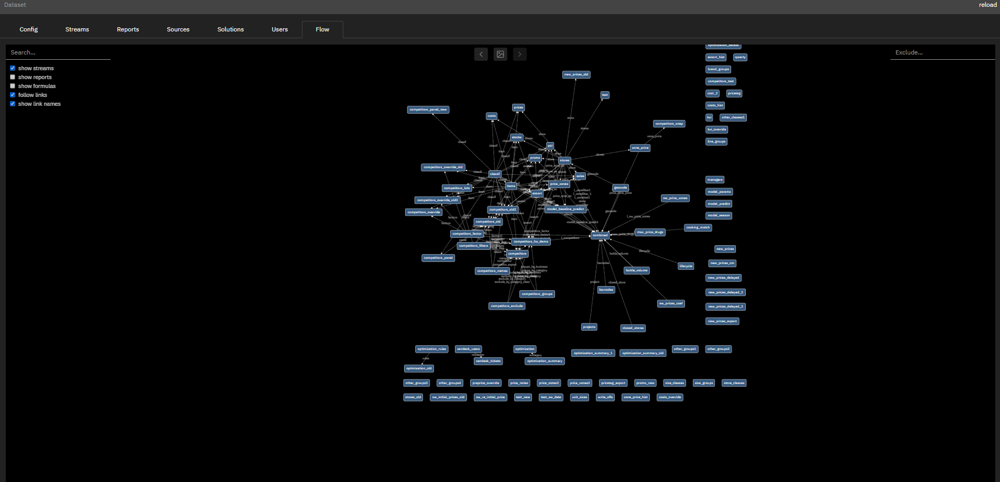

This tab displays relationships between entities in the system.
You can search by entity name via *Search* field.
You can exclude an entity via the *Exclude* field.
You can export links as png images.
You can choose displayed entities via the flags on the left:

- Streams: show streams
- Reports: show reports
- Formulas: show formulas
- Links: follow links
- Link names: show link names

<style>
h1 img {
  display: inline-block;
  height: 22px;
  margin-top: -3px;
  margin-left: -16px;
}
</style>