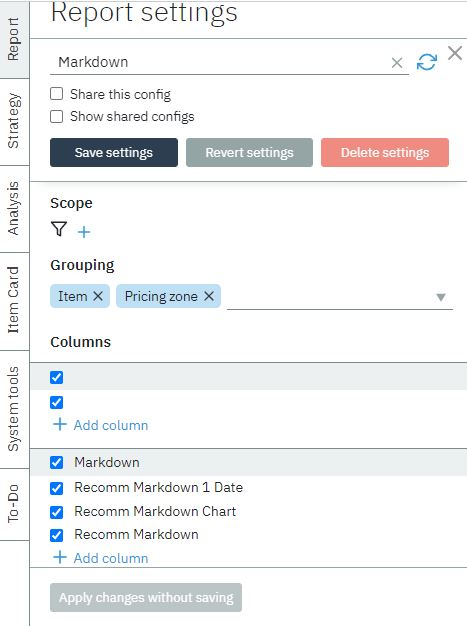
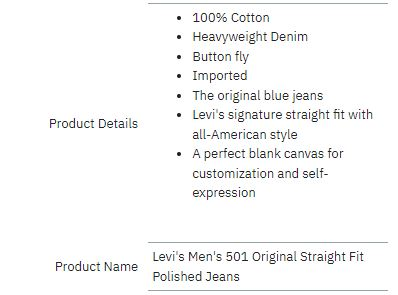

The secondary navigation bar allows you to move to the main pages within 
Markdown Optimization.

# Report 

The Report tab is the central repository for all markdown plans.
You can also create a new strategy for the report, as well as create new markdown report.
See [“Creating Markdown Report”](../process/report)  for more information about 
markdown report.

# Strategy 

The Strategy Tab is the central repository for all srategies and price rules.
See [“Creating Strategy”](../process/strategy)  for more information about scenarios.

# Analysis 

The Analysis Tab displays graphical, analytical insights reports to assist you 
while using Markdown Optimization. You can use these analytical insights when 
planning your markdown plans.

# Item Card

The Item Card tab contains all the information about the product, such as description and image. 
