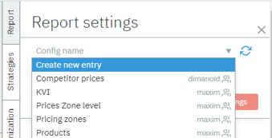

# Create Report

1.  Select "*Create a new entry"* in the field "Config name" and type
     the name of the new report

2.  Add the necessary *scope* to the report

3.  Add the *groupings* according to which the data will be shown in
     working table

4.  Add the *columns* that represent the data you need

Remember to apply the changes for the content table to update the data

# Report Columns

Dimensions section of the table defines grouping according to which the table was formed. Other sections of the table are entirely customizable for your own preference and linking.

To organize the data effectively, you can add columns that represent the information you need and group them into sections

More about [Available Metrics.](./../../../../config2)
