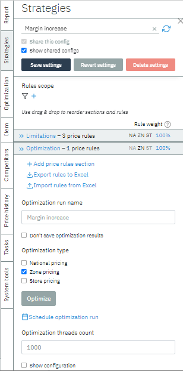
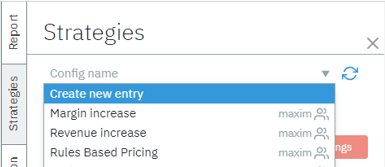
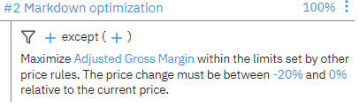

# Create Strategies

Strategies for price optimization can be formed in three ways:

-   Create a new strategy and add price rules,

-   Export/import rules to Excel,

-   See existing configuration in the Strategies tab

After defining the scope - a list of items whose price will be
optimized - by selecting the report or creating a new one; you can
proceed to set the price rules for those items to be optimized.

The number of rules, their scope & custom parameters can be saved as a
strategy configuration.

In the Strategies Tab, select "*Create a new entry"* in the field
"*Config name*" and type the name of the new strategy.

By clicking "*Show shared config*", you will be able to view other
strategies done by other users if they have checked the box "*Share this
config*" when they save the settings.

To add the price rule, create the rules section by clicking "Add price
rules section" and give it a name.

Then click "Add price rule"

# Markdown Price Rules

The markdown strategy consist of 2 components:

* Markdown configuration & goal
* Business Factors & Limitations

**Markdown Goal**: makrdown strategy can have an objective, what goal is it trying to achieve. 
You can set this rule to maximize: 
* Revenue
* Gross margin
* Sell Through
* Adjusted Gross Margin

To set up a markdown pricing strategy:

1.	Cofigure the maximum number of markdowns to be allowed (e.g. 1-3).
2.	Select the percentage discounts that will be available for use (e.g. 5, 10, 15, 20, 25, 30, 35, 40, 45, 50).
3.	Set the minimum time that must pass between markdowns (e.g. 1 week).
4.	Determine the number of days from the start date that the first markdown will be allowed (e.g. 0 day(s)).
5.	Leave the markdown dates and enforce markdowns for options blank.

