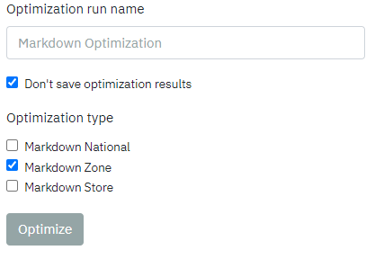

# Markdown Reports

The report defines the data that you see in the table, allowing you to customize the information displayed by grouping through specified attributes, 
selecting the desired columns, and defining the scope. 
You can either create a new report or choose an existing one, and the scope, grouping attributes, and selected columns can be saved as a configuration. 

If you click on "Show shared config," you will be able to view configurations created by other users who have chosen to share their settings. 
The columns in the report are organized into sections, such as inventory item markdown forecast, 
which contain specific metrics like gross margin and sales units. If you need to refresh the table, 
you can do so by clicking the refresh sign at the top of the table or by clicking the "apply changes without saving" button within the report tab.

To use the report feature:
1.	Navigate to the report tab.
2.	You can either create a new report or select an existing one from the options provided.
3.	Select the desired grouping attributes, columns, and scope for the report. These can be saved as a configuration for future use. To view configurations shared by other users, click on "Show shared config".

4.	To refresh the table, click on the refresh sign at the top of the table or use the "Apply changes without saving" button within the report tab.
5.	The report will display data based on the selected grouping attributes, columns, and scope. Columns are divided into sections such as inventory item markdown forecast, which may contain metrics such as gross margin and sales units.

**See [“Creating Markdown Reports”](./report) for more information about markdown reports.**

# Markdown Strategy

The markdown strategy consist of 2 components:

* markdown goal
* Business Factors & Limitations

**Markdown Goal**: makrdown strategy can have an objective, what goal is it trying to achieve. 
You can set this rule to maximize: 
* Revenue
* Gross margin
* Sell Through
* Adjusted Gross Margin
---
## **Setup a markdown pricing strategy:**

1. Navigate to the markdown configuration rule.
2. Determine the maximum number of markdowns to be allowed (e.g. 3).
2.	Select the percentage discounts that will be available for use (e.g. 5, 10, 15, 20, 25, 30, 35, 40, 45, 50).
3.	Set the minimum time that must pass between markdowns (e.g. 1 week).
4.	Determine the number of days from the start date that the first markdown will be allowed (e.g. 0 day(s)).
5.	Leave the markdown dates and enforce markdowns for options blank.
6.	Navigate to the markdown optimization rule.

7.	Set the markdown goal to maximize Gross Margin, Revenue, Sell Trough, or Adjusted Gross Margin.
8.	Set the price change limits to be between -20% and 0% relative to the current price.

---
## **Set other rules (more at ["Creating Strategies"](./strategy))**

---
## **Go to scopes and check MDO for recommendations**
1.	MDO items (items with recommendations)
2.	MDO recs (items with recommendations this week)

# Price Markdown Recommendation Analysis

Checking forecasts involves reviewing the predicted demand for items that are being considered for markdown. 
This can be done overall or on a per-item basis. This helps to ensure that markdowns are being applied to 
items that are not expected to sell well in the near future.

1. Compare different scenarios to see how they would impact the performance of the markdown strategy. This can include comparing different levels of markdown, different timing of markdowns, or different combinations of items to be marked down.

2.	Checking the analysis tab by item involves reviewing the data and recommendations for each item individually to ensure that the markdown strategy is appropriate for that specific item.

3.	Overriding recommendations allows the user to make changes to the markdown strategy based on their own analysis or business objectives.

   

4.	Approving the markdown strategy involves committing to implementing the recommended markdowns.

 

5.	Mass approving allows the user to quickly approve markdown recommendations for multiple items at once, rather than reviewing and approving them individually.

