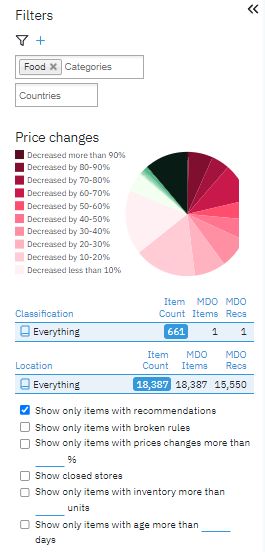
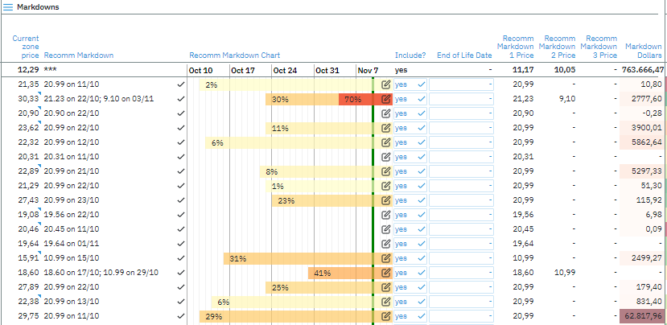

# GoalProfit Markdown Optimization

Markdowns are used to temporarily increase demand for low-demand products, ideally long enough to sell through all stock. Markdowns are caused by excess inventory at the end of a selling season. Since most markdowns are not planned for in advance (or at least accounted for in the pre-season planning stages), they frequently drain profits considerably more than they have to.

Most retailers would rather have a little bit of extra inventory left over than not enough (which would signify that they lost sales). And cutting prices is the only way to clear this leftover inventory at the end of a season or of a product’s lifecycle. Markdown Optimization allows you to schedule price reductions over a time interval to help you manage products out of assortments gracefully and cost-effectively.

Our platform helps you determine a retail markdown strategy that is integrated into your larger pricing strategy, ensuring that you consider a product's entire price strategy throughout its life cycle. This includes initial pricing and all promotional events, ensuring that your markdown strategy is effective and aligned with your overall financial goals.

# Getting Started

The markdown optimization process begins with the creation of a markdown report and the configuration of a markdown strategy. Setting the scope and rules for the optimization process is part of this. After you've established the strategy, you may optimize the markdown pricing by selecting the scope (such as categories or stores) and the items with markdown recommendations. Time sentsitive recommenndations (for the current week) will be higlighted separately.

After you've decided which products to optimize, you may analyze the recommendations to double-check the forecasts and compare different optimization runs. You may also review the analysis tab for each individual item and, if required, override the suggestions. Finally, you may approve the markdown recommendations and, if necessary, mass approve them.

* Initial Setup
  * [About Goalprofit Applications](../user_guide/)
  * [Markdown Navigation Bar](navigation/)
    * Report
    * Strategy
    * Analysis
* Markdown Science & Modeling
  * [Basic Markdown Optimization Process](process/)
    * Setup 
    * Create Markdown Report & Strategies
    * Optimize and review results
    * Implement & mass aprove prices

# Audience

Markdown Optimization is designed for these primary audiences: 

* Merchandising Executives
* Category Managers
* Pricing Managers 
* Pricing Analysts 
* Buyers

Using pricing optimization retailers get:
- Integrating planning with pricing enables a retailer to create an optimal product journey.
- Retail AI uses limitations, goals, and sales history to minimize cost and maximize profit. 

Pricing solutions enable retailers to maximize GMROI (Gross Margin Return on Investment) 
by setting optimal initial prices, promotions, and markdowns.

# About GoalProfit Applications 

GoalProfit is designed to automate pricing, making recommendations based on price rules, competitor prices, forecasts, and elasticity.
This guide provides a basic introduction to the GoalProfit platform and its components.

There are 3 components: The Content Table, Filters & Scope and the Report & Strategies configuration.

On the left side of the screen you can expand the filter tab to visualise the price changes among the items selected for optimization.

Filters allows you to view the products based on categories, countries etc. Additional filters can be checked to return only items with recommendations, showing only items with prices changes more than certain %, items with certain amount of inventory etc.

The content table represent data requested in report settings. Markdown report consist of the recommended markdown which is the price to which item should be adjusted and recommended markdown chart which represents the period during which markdown takes place. Additional columns can be added into the table to support more informative analysis.

Additional sections of the table can be added to enhance the knowledge surronding inventory, sales, profits & productivity.

---
**KVI & Dashboards**

More at [Menu Panel](../user_guide/menu)

---

jj

