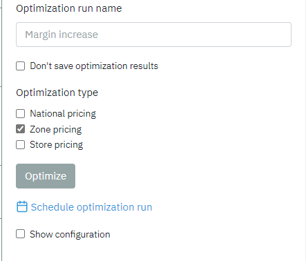
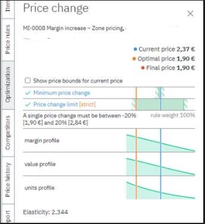
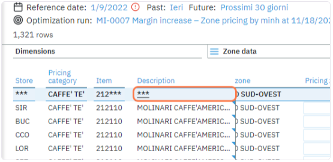
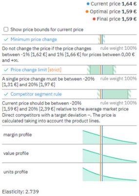
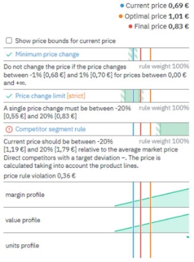

# Price Optimization 

You can check the results of the Optimization Run in the Optimization
Tab. When checking "*don't save optimization results*", the run results
will not be visible in the optimization quick access bar. You can still
find the optimization run in the history tab. There is an option to
schedule the optimizations.

The optimization list all the price rules used in this strategy and
compliance with them. Any violation of the rule will be flagged & the
graph description will show those violation.

The Optimization tab will show you price changes for an individual item
when you click on them in the content table. By choosing "\*\*\*" in the
table, you will select all the items within the scope and see the
overall price change for all items.

This page is used for *Pricing Strategy assessment & review*: when the
strategy is accurate & well-designed, the **final price**
value will be as close as possible to the **optimal price**.
The price rules that deviate the final price away from optimal will be
flagged, and rule violations will be shown in monetary value. The rules
flagged with violation might require further inspection & certain
adjustments to ensure a better pricing strategy moving forward.

**Current_price** is the value ​​of the current price in the store for the
product for the calculation.\
**Optimal_price** presents the value that violates all the rules with a
minimal error rate.\
**Final_price** recalibrates the price to abide by all strict rules in the
optimization process.

