# Rules Parameters, Settings & Template for Design mode
### Glossary

* [Same Price Rule](#same-price-rule-same_price)
* [Price Change Rule](#price-change-rule-pct_change)
* [Relation Rule](#price-relationship-rule-relations)
* [Fixed Price Rule](#fixed-price-rule-fixed_price)
* [Minimum Change Rule](#minimum-change-rule-min_price_change)
* [Rounding Rule](#rounding-rule-rounding_range)
* [Competitors Rule](#competitors-rule-competitors)
* [Consumer Price Index Change Rule](#consumer-price-index-change-rule-cpi)
* [Other Rules](#other-rules)


The rules include a *common set of settings* for all rules called
\<header\> and *individual settings* depending on the rule type. All
types of price rules have a common set of parameters listed below:
Common \<header\> parameters used in rules:

-   **grouper**: defines independent product groups within which the
    rule will work.

-   **filter**: Filters the data for the rule, including the filter
    results.

-   **filter_not**: Filters the data for the rule, discarding the filter
    results.

-   **id**: id of the rule.

-   **name**: the name of the rule.

-   **weight**: weight of the rule for the optimizer. In the event of a
    conflict between non-strict rules, a price will be chosen such
    that the sum of the products of weight times the price deviation
    from the allowable price in the rule will be minimal for all
    non-strict rules.

-   **strict**: Flag for the strictness of the rule.

-   **text**: The text of the rule that the user will see. Customizable
    options are marked with curly braces.

-   **number**: The sequence number of the rule. If there is a conflict
    between strict rules, the rule with the lower sequence number will
    take precedence.

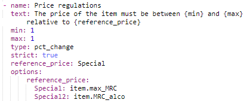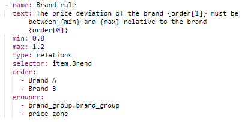

Example of the rule in YAML format

-   Each identifier must be described as a field in this template (*min,
    max, reference_price*).

-   When the field is of a simple type (*number, boolean, string*), you
    will be prompted to enter a value in the input field when creating
    a rule (*min, max,* in the example).

-   When the field should have multiple options, assign a string
    human-readable description to the field where:

    a.  The key is the name of the field and the value is an
        object/dictionary

    b.  The key is a human-readable description and the value is a
        simple type value.

-   The user will be able to select a value from a list of elements
    (true/false; reference_price as *Special* & *Special2* in the
   example), while the optimizer will receive the chosen object
   value.

-   By adding the field *[multiple: true]{.underline}* next to
    *options*, you can select not one value from the list, but
    several. This is applied in the CPI rule below.

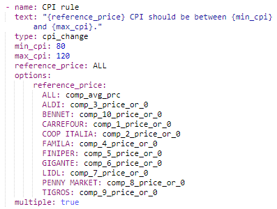

-   *Grouper* defines attributes by which grouping occurs. These are
    instructions for selecting data for the optimizer (specifically
    the retail service). Based on the grouper values, the retail
    service will collect all reports of the items into groups that can
    optimize independently. All items with the same set of grouper
    values ​​must be counted together.

-   *Order* as a parameter specifies the attribute\'s dimension by which
    the grouping occurs & the rank will be assigned. Each value in the
    *order* setting list forms a separate group.

-   Other fields (such as *selector*) depend on the rule type and work
    differently. As a rule, these are also valid vals expressions,
    which are additionally requested from combined and contain
    important information for optimization


# Same Price Rule **Same_Price**

**Rule Fill Template:**

```yaml
name: <rule name displayed to the user>
text: <the text of the rule to display to the user to pass meaning and parameters>
type: same_price
strict:<flag to determine if the rule is strict>
grouper:
-	<attribute 1 for grouping>
-	...
-	<attribute n by which grouping occurs>

  ```

**Custom Parameters:**

This rule has no configurable parameters

**An example of setting a rule in the design interface:**

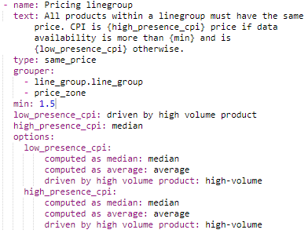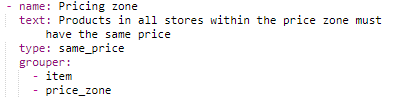


```yaml
    - name: Price line
     text: The product in all stores within the price zone must have the same price
     type: same_price
     grouper:
     - line_groups_h.scale_horizontal_id
  ```

# Price Change Rule **Pct_Change**

**Custom Parameters:**

-   reference_price: defines the attribute against which the recommended
    price will change

-   min: defines the lower limit of change relative to reference_price,
    set as a percentage

-   max: defines the upper limit of change relative to reference_price,
    set as a percentage

Optional parameters:

-   target: defines the price that the rule will aim for. If the
    parameter is not specified, then the recommended price will change
    against reference_price.

**Rule Fill Template:**

```yaml
- name: <rule name displayed to the user>
   text: <the text of the rule to display to the user to pass meaning and parameters>
   type: pct_change
   min: <Bottom line, calculated as price change ratio, where 1 = 100%>
   max: <Upper limit, calculated as price change factor, where 1 = 100%>
   reference_price: <attribute with the specified price against which the recommended price will change>
   target: <desired price change ratio, where 1 = 100%>
  ```


**An example of setting a rule in the design interface:**

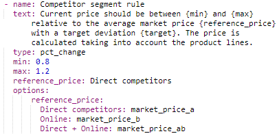
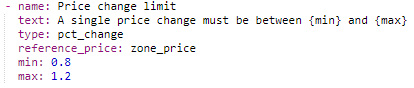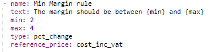
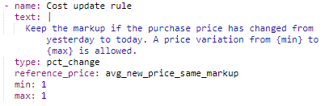

```yaml
   - name: Price change limit
  text: One-time price change must be between {min} and {max}.
  type: pct_change
  reference_price: price_zone_price.price
  min: 0.8
  max: 1.2
  ```

# Price relationship Rule **Relations**

**Custom Parameters:**

-   **min**: the lower limit of the range in % change from the base
     price between two neighboring groups. Accepts numeric values,
     where 1 will be defined as 100%.

-   **max**: the upper limit of the range in % change from the base
     price between two neighboring groups. Accepts numeric values,
     where 1 will be defined as 100%.

-   **selector**: an attribute that defines the product groups for which
     the rule works.

-   **order**: Specifies the order in which groups are ranked.

-   **grouper**: defines independent product groups within which the
     rule will work.

**Optional parameters:**

-   **firstIsAnchor**: flag to use the value of the first element
     specified in the order as the anchor price. Option\<bool\>

-   **lastIsAnchor**: flag to use the value of the last element
     specified in the order as the anchor price. Option\<bool\>

-   **minEquivIsAnchor**: flag to use the element\'s value with the
     minimum equivalent price as the anchor price. Option\<bool\>

-   **minEquiv_selector**: an attribute that specifies the relative
     weight of the item to determine the minimum equivalent price for
     the minEquivIsAnchor flag.

-   **anchor_selector**: An attribute that automatically defines
     candidates for selecting an anchor product.

-   **volume_selector**: An attribute that specifies the relative size
     of the item.

**Rule Fill Template:**

```yaml
name: <rule name displayed to the user>
text: <the text of the rule to display to the user to pass meaning and parameters>
min: <lower limit, calculated as price change factor, where 1 = 100%>
max: <upper limit, calculated as price change factor, where 1 = 100%>
type: relations
selector: <attribute that defines product groups for which the rule works>
grouper:
<attribute 1 for grouping>
...
<attribute n by which grouping occurs>
order:
<dimension of the attribute by which the rank 1 will be assigned>
<dimension of the attribute by which the rank 2 will be assigned>
...
<dimension of the attribute by which the rank n will be assigned>
  ```
  
**An example of setting a rule in the design interface:**

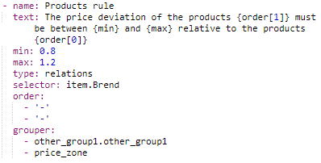
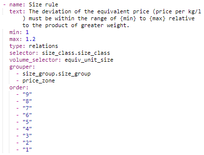


```yaml
 - name: Cross-zone rule
   text: |The price deviation for a product with less fat content/aging should be within 
   the range of {min} to {max} relative to fat content/aging. {lastIsAnchor}.
   type: relations
   selector: price_zone
   grouper:
- item
   order:
- milk_fat
   min: 0.8
   max: 1.2
  ```
  
# Fixed Price Rule **Fixed_Price**

**Custom Parameters:**

-   **selector**: condition that defines product groups for which the
     rule works

-   **reference_price**: attribute containing the fixed price value

**Rule Fill Template:**

```yaml
-  name: < the name of the rule displayed to the user >
   text: <the text of the rule to display to the user to pass meaning and parameters>
   type: fixed_price
   selector: <condition defining product groups for which the rule works>
   reference_price: <attribute with a value that is set when the rule is triggered>
```

**An example of setting a rule in the design interface:**

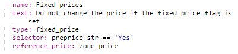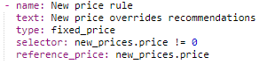
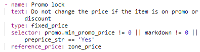

```yaml
- name: Promo fixed price rule
   text: Do not change the price if the product is on promotion or on sale
   type: fixed_price
   selector: new_prices.price != 0
   reference_price: new_prices.price
```

# Minimum Change Rule **Min_Price_Change**

**Custom Parameters:**

-   min: defines the lower limit of change relative to reference_price,
     set as a percentage

-   max: defines the upper limit of change relative to reference_price,
     set as a percentage

**Optional parameters:**

-   **reference_price**: reference price for the range

-   **range_start:** lower limit of rule triggering (absolute value)

-   **range_end:** upper limit of rule triggering (absolute value)

**Rule Fill Template:**

```yaml
- name: <rule name displayed to the user>
  text: <the text of the rule to display to the user to pass meaning and parameters>
  type: min_price_change
  min: <lower limit, set as a coefficient of price change in percent>
  max: <upper limit, set as a coefficient of price change in percent>
  reference_price: <attribute with the specified price against which the bounds are calculated>
  range_start: <minimum price value at which the rule is triggered>
  range_end: <maximum value at which the rule is triggered>
```

**An example of setting a rule in the design interface:**


```yaml
- name: Price change
text: Do not change the price if the price change is between {min} and
{max} for prices between {range_start} and {range_end}.
type: min_price_change
reference_price: price_zone_price.price
min: 0.99
max: 1.01
range_start: 0
range_end: 10000000
  ```

# Rounding Rule **Rounding_Range**

**Custom Parameters:**

-   **rounding_ranges:** sets the rule operation range in absolute
     numbers

    -   **start**: the starting value of the range.

    -   **end**: the ending value of the range..

-   **wholeEndings**: specifies a list in the price of valid units and
     tens values ​​in the format from 00 to 99

-   **fractionalEndings**: sets a list of valid values ​​in the price for
     the fractional part in the format from 00 to 99

***Optional parameters:***

-   **selector:** sets the conditions for selecting commodity items with which the rule will work
-   **rounding_method:** rounding method used in the rule
    -   nearest (mathematical)
    -   floor (down)
    -   cell (up).
-   **ignorePrices**: a list of price values ​​that are excluded from the operation of the rule.

**Rule Fill Template:**
```yaml
- name: <rule name displayed to the user>
 text: <the text of the rule to display to the user to pass meaning and parameters>
    type: rounding
    rouding_ranges:<rule firing range>
- start <lower range limit in absolute values>
- end <upper range limit in absolute values>
    wholeEndings: <allowed values for units and tens in the format 00 to 99>
    fractionalEndings: <allowed values for fractional end in format from 00 to 99>
    selector:
- <condition 1, according to which rounding occurs>
- ...
- <condition n for rounding off>
    rounding_method: <logic for rounding>
    ignorePrices: <list of exceptions that will not be rounded up>
  ```

**An example of setting a rule in the design interface:**

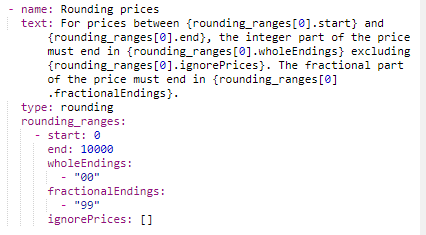

```yaml
- name: Price rounding
 text: For product prices in the range {rounding_ranges[0].start} to {rounding_ranges[0].end}, the whole part of the price must end in {rounding_ranges[0].wholeEndings} excluding the prices {rounding_ranges[0].ignorePrices}. The fractional part of the price must end with {rounding_ranges[0].fractionalEndings}.
     type: rounding
     rounding_ranges:
- start: 0
- end: 10000
     wholesale Endings:
- "00"
     fractional Endings:
- "99"
     ignorePrices: []
  ```

# Competitors rule **Competitors**

**Rules Description:**

This rule sets the deviation of price changes to be relative to
Competitors pricing in the market.

**Custom Parameters:**

-   min: defines the lower limit of change relative to reference_price,
     set as a percentage

-   max: defines the upper limit of change relative to reference_price,
     set as a percentage

Optional parameters:

-   target: defines the price that the rule will aim for. If the
     parameter is not specified, then the rule will seek
     reference_price.

**Rule Fill Template:**
```yaml
- name: <rule name displayed to the user>
text: <the text of the rule to display to the user to pass meaning and parameters>
type: competitor
min: <Bottom line, calculated as price change ratio, where 1 = 100%>
max: <Upper limit, calculated as price change factor, where 1 = 100%>
competitor: <competitor name>
options: 
  competitors:
-	<competitor 1>
-	<competitor 2>
-	…
  ```

**An example of setting a rule in the design interface:**


```yaml
- name: Competitor rule
text: The price deviation must be between {min} and {max} relative to the competitor {competitor} with a target deviation {target}. 
The price is calculated taking into account the product lines.
type: competitor
min: 0.8
max: 1.2
competitor: <competitor name>
options: 
  competitors:
-	<competitor 1>
-	<competitor 2>
-	…
  ```

# Consumer Price Index Change rule **CPI**

**Rules Description:**

This rule sets the deviation of price changes to be relative to CPI
reference_price, within which it should be formed.

**Custom Parameters:**

-   min_cpi: defines the lower limit of change relative to
     reference_price, set as a percentage

-   max_cpi: defines the upper limit of change relative to
     reference_price, set as a percentage

-   reference_price: \<attribute with the specified price against which
     the recommended price will

Optional parameters:

target: defines the price that the rule will aim for. If the parameter
is not specified, then the rule will seek reference_price.

**Rule Fill Template:**
```yaml
- name: <rule name displayed to the user>
text: <the text of the rule to display to the user to pass meaning and parameters>
type: cpi_change
min_cpi: <Bottom line, calculated as price change ratio>
max_cpi: <Upper limit, calculated as price change factor>
reference_price: <attribute with the specified price against which the recommended price will change>
options: 
  reference_price:
-	<competitor 1>
-	<competitor 2>
-	…
Multiple: <true/false>
  ```


**An example of setting a rule in the design interface:**

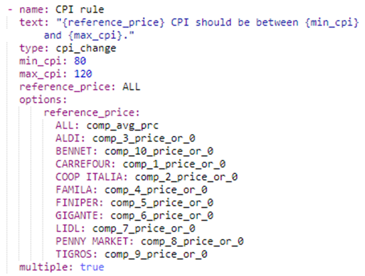

```yaml
- name: CPI rule
          text: "{reference_price} CPI should be between {min_cpi} and {max_cpi}."
          type: cpi_change
          min_cpi: 80
          max_cpi: 120
          reference_price: ALL
          options:
              reference_price:
                ALL: comp_avg_prc
                ALDI: comp_3_price_or_0
                BENNET: comp_10_price_or_0
                CARREFOUR: comp_1_price_or_0
                COOP ITALIA: comp_2_price_or_0
                FAMILA: comp_4_price_or_0
                FINIPER: comp_5_price_or_0
                GIGANTE: comp_6_price_or_0
                LIDL: comp_7_price_or_0
                PENNY MARKET: comp_8_price_or_0
                TIGROS: comp_9_price_or_0
          multiple: true
  ```

# Other rules 


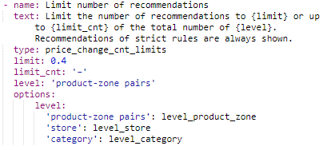

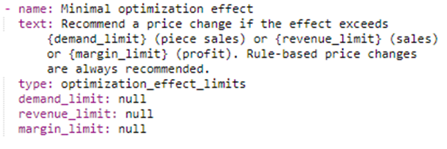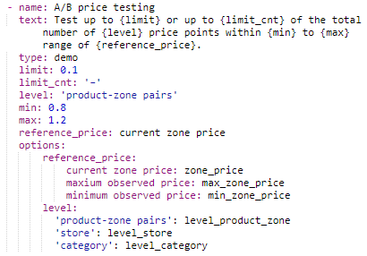
