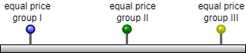
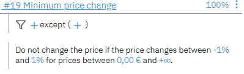

## Glossary

* [Same Price Rule](#same-price-rule)
* [Price Change](#price-change-rule-pct_change)
* [Relation Rule](#price-relationship-rule-relations)
* [Fixed Price](#fixed-price-rule)
* [Minimum Change Rule](#minimum-change-rule)
* [Rounding Rule](#rounding-rule-rounding_range)

# Same Price Rule

**Rule description:**

All items defined in the scope of the rule must receive the same price
in the recommendation.

**The logic of the price rule:**

When processing a rule, the system performs the following actions:

-   Selects the items filtered by specified conditions

-   Enriches them with grouping attributes

-   Splits into groups according to grouping attribute values

For selected groups, a single price is formed for all items.

**Processing Description:**

The system selects the filtered items for optimization and enriches them
with the values ​​of the grouping attributes specified in the *grouper*
parameter.

For selected groups, the price is set equal to the mode value (the value
that occurs most often among all values) within the group. If the mode
value cannot be found, then the minimum value in the group is taken.

For this example, we take a list of soda beverages sold in this retail
store.

Input data after enrichment with the values ​​of the grouping attributes
specified in the grouper parameter:

|Item|Store |Grouper attribute 1 |Grouper attribute 2 |Current Price|
|:----|:----|:----|:----|:----|
|Sprite 1L|A|1|3|29
Cola 1L|А|1|3|31
Fanta 1L|A|1|3|31|
|Sprite 1L|B|1|4|33
Cola 1L|B|1|4|35
Sprite 2L|A|2|5|46
Cola 2L|A|2|5|49|

Group I

|Item|Store |Grouper attribute 1|Grouper attribute 2 |Current Price|Modified Current Price|
|:----|:----|:----|:----|:----|:----|
|Sprite 1L|A|1|3|29 |31
Cola 1L|А|1|3|31 |31
Fanta 1L|A|1|3|31|31|

Group II

|Item|Store |Grouper attribute 1 |Grouper attribute 2 |Current Price|Modified Current Price|
|:----|:----|:----|:----|:----|:----|
|Sprite 1L|B|1|4|33 |33
Cola 1L|B|1|4|35 |33|

Group III

|Item|Store |Grouper attribute 1 |Grouper attribute 2 |Current Price|Modified Current Price|
|:----|:----|:----|:----|:----|:----|
|Sprite 2L|A|2|5|46 |46
Cola 2L|A|2|5|49 |46|

After that, the data from the groups is merged back into one table.

Output:

|Item|Store |Grouper attribute 1 |Grouper attribute 2 |Current Price|Modified Current Price|
|:----|:----|:----|:----|:----|:----|
|Sprite 1L|A|1|3|29 |31|
|Cola 1L|А|1|3|31 |31|
|Fanta 1L|A|1|3|31|31|
|Sprite 1L|B|1|4|33 |33
Cola 1L|B|1|4|35 |33
Sprite 2L|A|2|5|46 |46
Cola 2L|A|2|5|49 |46|

---
# Price Change Rule Pct_Change

**Rule description:**

This rule sets the boundaries of price changes relative to some
attribute or metric, within which it should be formed.

**The logic of the price rule:**

Acceptable range of price change is calculated in percentage based on
criteria specified (reference price) in the rule, followed by the
selection of the price within the range (which are set by the
coefficients min and max, %)

Examples of some rules:

**Processing description:**

The rule will calculate the range and check against the current price if
it satisfies the criteria. The selected price is the closest value
within the range specified by the reference price.

Suppose the current price is within the range & satisfies the rule. In
that case, its value is returned as a result:

If the current price does not satisfy the rule, then optimization will
return the value closest to the current price within the available range
that satisfies the rule

When the optional **target** parameter is specified, the final price
calculation logic changes:

*Target price = reference price \* target*

Target price is the value the new modified price should aim to return.
The optimization will ignore the current price and return the target
value from the specified range if the parameter is specified in the
rule:

In the case when multiple rules are present, the optimization will
return a value that satisfies all rules. In the example below, the
calculated price (target_price) according to the first rule does not
satisfy the second rule, so the result will be a value as close as
possible to the target price value of the first rule, but in the range
the second rule specified:

If it is impossible to pinpoint the price that satisfies all the rules,
the optimization will return the result that violates all the rules with
minimum error. In the example below, the optimal price (Result) is not
within the range of either rule 1 or 3, but located between the
respective rules borders to minimize the error:

If there is a rule with a "strict rule" flag set, the final result will
change. First, optimization will determine the optimal price, as in the
example above. After optimization, there will be a process of checking
the implementation of strict rules, and the final price will be drawn to
the borders of the strict rule to fit the requirement.

If the \"strict rule\" flag is set for more than one rule (for rules 2
and 3), then the final price will be determined by the minimum border of
the range of the second rule.

Suppose the requirements of all strict rules cannot be satisfied. In
that case, priority is given to the strict rule with a lower sequence
number, and the price determined during the optimization process is set
with the minimum deviation from the range of the strict rule that cannot
be satisfied (Rule 3)

)

**Example**

Input data:

|Item|Store|*Min|*Max|Reference price|
|:----|:----|:----|:----|:----|
|Sprite 1L|A|2|3|23
Cola 1L|А|2|3|25
Sprite 1L|B|2|3|26
Cola 1L|B|2|3|29
Sprite 2L|A|2|3|35
Cola 2L|A|2|3|39|

\* - the parameter is set in the rule itself, it is not an attribute

Based on the reference_price and the values ​​of the min and max
parameters, the lower and upper limits of the allowable range are
calculated using the formula:

-   Bottom line = Reference price\*Min

-   Upper limit = Reference price\*Max

After calculating the lower and upper limits, it is checked if the
optimal price is within the allowed range and the closest value to the
reference price within the available range is selected.

|Item|Store |Bottom line|Upper limit|Reference Price|Optimal Price|Final Price|
|:----|:----|:----|:----|:----|:----|:----|
|Sprite 1L|A|46 |69 |23 |45 |46
Cola 1L|А|50 |75 |25 |60 |60
Sprite 1L|B|52 |78 |26 |59 |59
Cola 1L|B|58 |87 |29 |63 |63
Sprite 2L|A|70 |105 |35 |99 |99
Cola 2L|A|78 |117 |39 |120 |117|

The new price set for each item is returned.

Output:

|Item|Store |Reference price|Final Price|
|:----|:----|:----|:----|
|Sprite 1L|A|23 |46|
|Cola 1L|А|25 |60|
|Sprite 1L|B|26 |59|
|Cola 1L|B|29 |63|
|Sprite 2L|A|35 |99|
|Cola 2L|A|39 |117|

---
# Price Relationship Rule Relations

**Rule description:**

This rule establishes the distance in price (set in percentage
between groups of products belonging to the same family.

**The basic logic of the rule:**

The system selects filtered items and enriches them with the value of
attributes containing the dimension by which the ranking is built.

For each ranked group, new prices are formed within the range
constructed relative to the previous group. The order is determined by
sorting in the ***order*** field by the attribute specified in the
***selector***.

**Processing description:**

The relationship rule has optional parameters that change the
calculation logic once introduced. The list of optional parameters**:**

-   *firstIsAnchor*: flag to use the value of the first element/item
     specified in the order as the anchor price. [The range limits are
     formed relative to anchor price.]

-   *lastIsAnchor*: flag to use the value of the last element/item
     specified in the order as the anchor price.

-   *minEquivIsAnchor*: flag to use the value of the element/item with
     the minimum equivalent price as the anchor price.

See more in *[rules parameters](../parameters/)* section of this
documentation.

The version of the rule used in the analysis is a Vertical ruler rule, where 
the price deviation for a product of a larger volume must be between 
{min} and {max} relative to the price of a product of a smaller volume.

The range spesified for this rule is between 20% to 80% (min = 1,2; max =1,8),
The sorting order is determined by Volume attribute and the products are grouped
by stores they belong to.

The rule sets the minimum/maximum deviation between the prices of
related items/groups of items.

The min/max attributes set the coefficients of the minimum and maximum
deviations between prices, forming the limits of price change ranges.

If the prices of related items submitted for optimization do not satisfy
the rule (see below), then the limits of the ranges (min1; max1) and (min2; max2)
will be aligned between the median value, and the optimal prices 
will be set along the corresponding borders of these ranges 
in order to minimize deviations from the original prices:

If there are several products in the group: 

The boundaries of the ranges (min1; max1), (min2; max2) will be calculated from the average equivalent price (average price in the group divided by a common parameter, such as volume) in each group: 

The boundaries of the ranges always occurs separately for two groups, first for groups I and II 

Then for groups II and III

If some of the current prices do not satisfy the ranges, then the final price will be set at the border of the range 

***Input data:***

|Item|Store|Litrage|*Min|*Max|Current price|
|:----|:----|:----|:----|:----|:----|
|Cola 1L|A|1|1,2|1,8|31
Sprite 1L|A|1|1,2|1,8|35
Cola 2L|A|2|1,2|1,8|53
Cola 3L|A|3|1,2|1,8|63
Sprite 3L|A|3|1,2|1,8|75|

\* - the parameter is set in the rule itself, it is not an attribute.

Current price - an attribute with the values ​​of the current price in the
store for the product for the calculation date (combined source), based
on which new prices are calculated.

According to the order specified in the **order** parameter
and the attribute specified in the **selector]**, the items
are ranked and combined into groups.

|Item|Store|Litrage|Rank|*Min|*Max|Current price|
|:----|:----|:----|:----|:----|:----|:----|
|Cola 1L|A|1|1|1,2|1,8|31
Sprite 1L|A|1|1|1,2|1,8|35
Cola 2L|A|2|2|1,2|1,8|53
Cola 3L|A|3|3|1,2|1,8|63
Sprite 3L|A|3|3|1,2|1,8|75|

Grouping occurs by the Literage attribute specified in the
**selector**, according to the order value.

Each value in the **order** setting list forms a separate
group.

Since the values 1,2,3 are sequentially specified in the order, the
first group will be according to the condition Litrage = 1, the second
group will be according to the condition Litrage = 2, and the third
group will be according to the condition Litrage = 3.

|Item|Store|Litrage|Rank|*Min|*Max|Current price|Group|
|:----|:----|:----|:----|:----|:----|:----|:----|
|Cola 1L|A|1|1|1,2|1,8|31 |I|
|Sprite 1L|A|1|1|1,2|1,8|35 |I|
|Cola 2L|A|2|2|1,2|1,8|80 |II|
|Cola 3L|A|3|3|1,2|1,8|135 |III|
|Sprite 3L|A|3|3|1,2|1,8|150 |III|

For each group, new prices are calculated by an algorithm that selects
the values of new prices with a total minimum error weight.

**Output data:**

In the process of searching for optimal prices and 
minimizing deviations (errors), all prices in groups may change.

|Item|Store|Litrage|Current price|Equal price|Relation current price|Final price|Equal final price|Relation final price|
|:----|:----|:----|:----|:----|:----|:----|:----|:----|
|Cola 1L|A|1|31 |(31+35)/2/1=33| |28|(28+30)/2/1=29| |
|Sprite 1L|A|1|35 |(31+35)/2/1=33| |30|(28+30)/2/1=29| |
|Cola 2L|A|2|80|80/2=40|40/33=1,212|76 |76/2=38|38/29=1,31|
|Cola 3L|A|3|135 |(135+150)/2/3=47,5|47,5/40=1,1875|138 |138/3=46|46/38=1,211|
|Sprite 3L|A|3|150 |(135+150)/2/3=47,5|47,5/40=1,1875|152|152/3=50,666|50,666/38=1,333|

Setting the *firstIsAnchor* attribute rigidly fixes the price of the
first product (when setting lastIsAnchor - the last product) and the
range limits are formed relative to this price, in accordance with the
min and max coefficients.

After determining the optimal price of the second product, this price is
fixed and the limits of the price ranges of the third product are formed
relative to the optimal price of the second product

If the firstIsAnchor attribute is specified for this rule, then the price
the first products in the lines will be rigidly fixed and the calculation will change:

**Output data:**

|Item|Store|Litrage|Current price|Equal price|Relation current price|Final price|Equal final price|Relation final price|
|:----|:----|:----|:----|:----|:----|:----|:----|:----|
|Cola 1L|A|1|31 |(31+35)/2/1=33| |31| | |
|Sprite 1L|A|1|35 |(31+35)/2/1=33| |35| | |
|Cola 2L|A|2|80|80/2=40|40/33=1,212|80 |80/2=40|40/33=1,212|
|Cola 3L|A|3|135 |(135+150)/2/3=47,5|47,5/40=1,1875|138 |138/3=46|46/38=1,211|
|Sprite 3L|A|3|150 |(135+150)/2/3=47,5|47,5/40=1,1875|150|150/3=50|50/40=1,25|

---
# Fixed Price Rule 

**Rule description:**

This rule fixes the price of items in accordance.

**The logic of the price rule:**

For filtered items, the condition from the selector parameter is checked
(true/false). If the condition is met, the fixed price value from the
reference_price attribute is assigned.

*IMPORTANT!: The rule conflicts with the rounding rule. If both rules
are set in one scenario, then the rounding rule will not work in the
scenario.*

**Processing description:**

The system selects filtered items for optimization and enriches them
with attribute values ​​containing fixed price values. The resulting items
are additionally divided into 2 groups depending on compliance with the
selector condition (mandatory). For a group that satisfies the selector
*true/false* condition, a fixed price is set.

Input data after enrichment with additional attributes

|Item|Store|Selector condition|Reference price|Current price|
|:----|:----|:----|:----|:----|
|Sprite 1L|A|false|-|29
Cola 1L|А|true|40|31
Sprite 1L|B|true|42|33
Cola 1L|B|false|-|35
Sprite 2L|A|true|70|46
Cola 2L|A|false|-|49|

The items that fulfill the conditions specified in the *selector*
parameter are determined:

For each of these lines, the system specifies the value from the
reference price parameter:

|Item|Store|Reference price|Current price|Optimal Price|Final Price|
|:----|:----|:----|:----|:----|:----|
|Cola 1L|А|40|31 |43 |40
Sprite 1L|B|42|33 |40 |42
Sprite 2L|A|70|46 |80 |70|

For other lines, the system does not change the price:

|Item|Store|Reference price |Current price|Optimal Price|Final Price|
|:----|:----|:----|:----|:----|:----|
|Sprite 1L|A|-|29 |45 |45
Cola 1L|B|-|35 |47 |47
Cola 2L|A|-|49 |77 |77|

After that, the values ​​are combined back

|Item|Store|Reference price |Current price|Optimal Price|Final Price|
|:----|:----|:----|:----|:----|:----|
|Sprite 1L|A|-|29 |45 |45
Cola 1L|А|40|31 |43 |40
Sprite 1L|B|42|33 |40 |42
Cola 1L|B|-|35 |47 |47
Sprite 2L|A|70|46 |80 |70
Cola 2L|A|-|49 |77 |77|

---
# Minimum Change Rule

**Rule description:**

This rule sets the minimum price change threshold.

**The logic of the price rule:**

For the selected items, the available interval range is calculated, and
the *new price* is checked for entering it. If the new price is within
the price change range (min/max), then *reference_price* is returned,
otherwise, the price is changed to the new price.

**Processing description:**

The system selects filtered items for optimization and enriches them
with attribute values ​​containing the price for which a range is built.
For each item, based on the reference_price, the lower and upper limits
of the minimum range of changes are calculated using the formula:

-   lower change limit = reference_price+(min\*reference_price)

-   upper change limit = reference_price+(max\*reference_price)

Input data:

|Item|Store|*Min|*Max|*Range start|*Range end|Reference price|
|:----|:----|:----|:----|:----|:----|:----|
|Sprite 1L|A|-10|10|20|50|29
Cola 1L|А|-10|10|20|50|31
Sprite 1L|B|-10|10|20|50|33
Cola 1L|B|-10|10|20|50|35
Sprite 2L|A|-10|10|20|50|46
Cola 2L|A|-10|10|20|50|49|

\* - the parameter is set in the rule itself, it is not an attribute

For each item, based on the reference_price, the lower and upper limits
of the minimum range of changes are calculated using the formula:

-   lower change limit = reference_price+(min\*reference_price)

-   upper change limit = reference_price+(max\*reference_price)

For each item, new prices are calculated:

|Item|Store|Reference price|Bottom line|Upper limit|New Price|
|:----|:----|:----|:----|:----|:----|
|Sprite 1L|A|29 |26,1 |31,9 |19
Cola 1L|А|31 |27,9 |34,1 |28
Sprite 1L|B|33 |29,7 |36,3 |37
Cola 1L|B|35 |31,5 |38,5 |40
Sprite 2L|A|46 |41,4 |50,6 |49
Cola 2L|A|49 |44,1 |53,9 |52|

Then a check is made for the entry of new prices into the range of the
minimum change:

|Item|Store|Reference price|Bottom line|Upper limit|New Price|Entry into the range|
|:----|:----|:----|:----|:----|:----|:----|
|Sprite 1L|A|29 |26,1 |31,9 |19 |no|
|Cola 1L|А|31 |27,9 |34,1 |28 |yes|
|Sprite 1L|B|33 |29,7 |36,3 |37 |no|
|Cola 1L|B|35 |31,5 |38,5 |40 |no|
|Sprite 2L|A|46 |41,4 |50,6 |49 |yes|
|Cola 2L|A|49 |44,1 |53,9 |52 |yes|

From the initial data, 2 groups are obtained

Group I - falling within the range for which the price remains at the
level of reference_price

Group II - falling into values ​​outside the range, for which a new price
is set

After that, the data from the groups is merged back into one table.

|Item|Store|Reference price|Bottom line|Upper limit|New Price|Entry into the range|Final price|
|:----|:----|:----|:----|:----|:----|:----|:----|
|Sprite 1L|A|29 |26,1 |31,9 |19 |no|19
Cola 1L|А|31 |27,9 |34,1 |28 |yes|31
Sprite 2L|A|46 |41,4 |50,6 |49 |yes|46
Cola 2L|A|49 |44,1 |53,9 |52 |yes|49
Sprite 1L|B|33 |29,7 |36,3 |37 |no|37
Cola 1L|B|35 |31,5 |38,5 |40 |no|40|

Output:

|Item|Store|Reference price|New Price|Final price|
|:----|:----|:----|:----|:----|
|Cola 1L|А|31 |28 |31
Sprite 2L|A|46 |49 |46
Cola 2L|A|49 |52 |49
Sprite 1L|A|29 |19 |19
Sprite 1L|B|33 |37 |37
Cola 1L|B|35 |40 |40|

**Options:**

If the range_start/range_end parameters are specified, the new price is
checked for being within the specified range. If the new price is not
included in the specified range, then a new price is set without
checking for entering the range (min/max).

A check is performed on the boundaries of the range specified by the
range_start/range_end parameters:

|Item|Store|*range_start|*range_end|New Price|The rule is triggered|
|:----|:----|:----|:----|:----|:----|
|Sprite 1L|A|20|50|19 |no|
|Cola 1L|А|20|50|28 |yes|
|Sprite 1L|B|20|50|37 |yes|
|Cola 1L|B|20|50|40 |yes|
|Sprite 2L|A|20|50|49 |yes|
|Cola 2L|A|20|50|52 |no|

For those lines for which the rule does not work, a new price is set:

|Item|Store|Reference price|New Price|
|:----|:----|:----|:----|
|Sprite 1L|A|29 |19
Cola 2L|A|49 |52|

The pricing of the remaining items is carried out according to the main
scenario.

---
# Rounding Rule Rounding_Range

**Rules Description:**

This rule sets the conditions and parameters for rounding prices for
items when post-processing prices.

**The logic of the price rule:**

For the selected items, the available interval is calculated, followed
by selection by rounding within the range according to the settings.

For a product group that meets the conditions specified in the
*selector* and *ignorePrices* parameters, prices are rounded according
to the settings specified in the rule.

Input data after enrichment with additional attributes:

|Item|Store|New Price|
|:----|:----|:----|
|Sprite 1L|A|46|
|Cola 1L|А|43|
|Sprite 1L|B|45|
|Cola 1L|B|40|
|Sprite 2L|A|124|
|Cola 2L|A|109|

For the input data, the range of rule triggering is formed, new prices
are checked for its occurrence. The range is formed from the start to
end attributes.

Range limits

|Item|Store|*Start|*End|New Price|Entry into the range|
|:----|:----|:----|:----|:----|:----|
|Sprite 1L|A|10|110|46|yes|
|Cola 1L|А|10|110|43|yes|
|Sprite 1L|B|10|110|45|yes|
|Cola 1L|B|10|110|40|yes|
|Sprite 2L|A|10|110|124|no|
|Cola 2L|A|10|110|109|yes|

\* - the parameter is set in the rule itself, it is not an attribute

A check is made to see if the new price values ​​are included in the
exclusion list:

|Item|Store|*IgnorePrices |New Price|Subject to exceptions|
|:----|:----|:----|:----|:----|
|Sprite 1L|A|46|46|yes|
|Cola 1L|А|46|43|no|
|Sprite 1L|B|46|45|no|
|Cola 1L|B|46|40|no|
|Cola 2L|A|46|109|no|

For groups of products that have passed the check, the rule is triggered
according to the specified conditions:

After that, the values ​​are combined back.

Output:

|Item|Store|New Price|
|:----|:----|:----|
|Sprite 1L|A|46|
|Cola 1L|А|40|
|Sprite 1L|B|45|
|Cola 1L|B|40|
|Sprite 2L|A|124|
|Cola 2L|A|105
#
#
#
#
##### Learn more about [rules parameters and how to set them](../parameters/).

