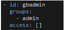
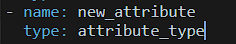
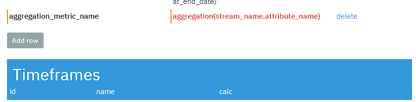
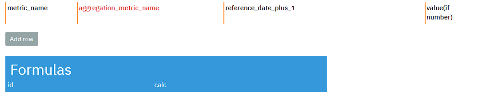
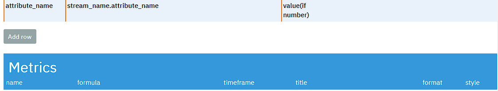
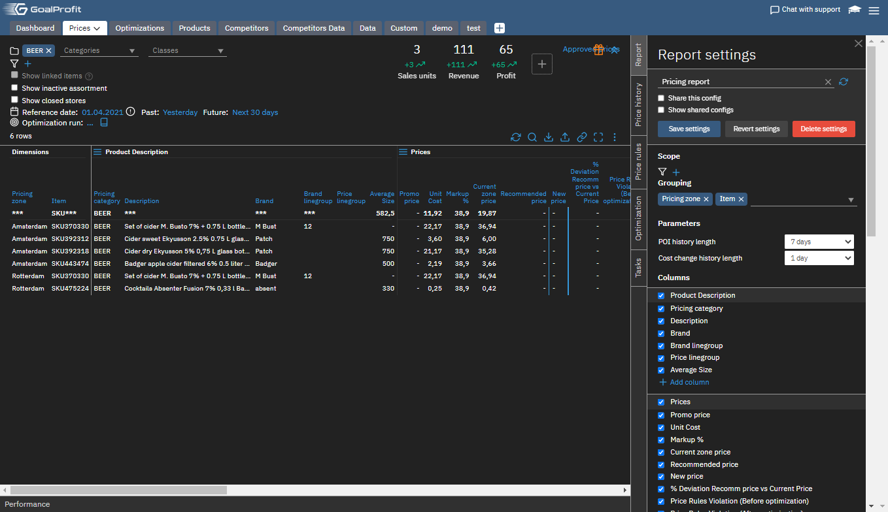
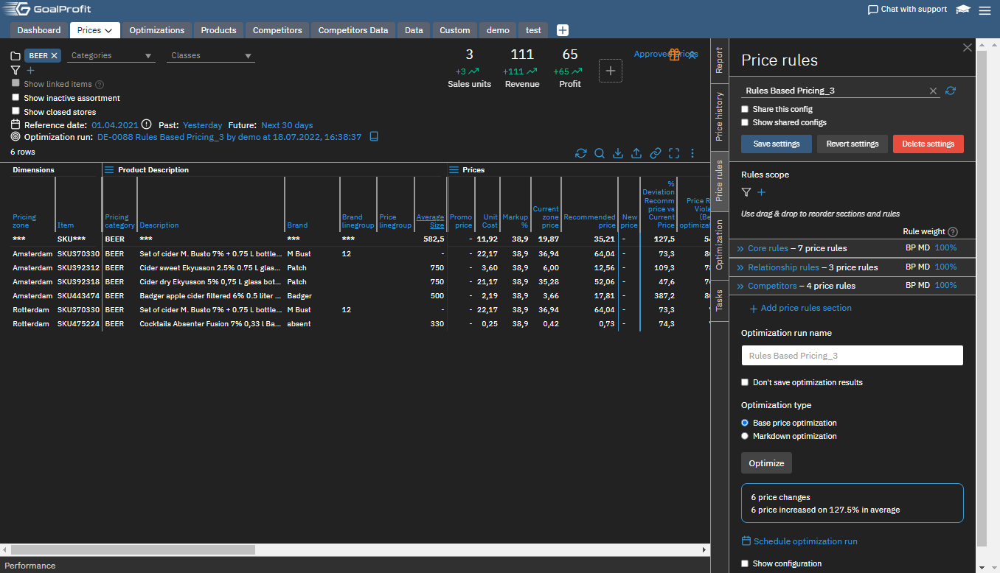
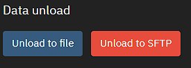

<h1> Quick start guide </h1>
This guide will help you to set up rule-based price optimization.
<h2>Add user</h2>
You should connect to the server through ssh, e.g. 

*ssh root@'server ip'*
After that, you need to enter the command:

*htpasswd -bB /gp/.htpasswd 'username' 'password'*
User now must be added to the system in the https://hostname/admin#/dataset/users tab, e.g. user with administrator rights:

<h2>Load data</h2>
You need to load data into system through streams. Copy your files in csv UTF-8 or xlsx format into /gp/retail directory on server. Gz compression is also available. 
Files should be as folow:

* items: *items.csv* contains list of items 
attribute set:
  **item** (string)
  **item_description** (string)
  **class** (string)
* stores: *stores.csv* contains list of stores
attribute set:
  **store** (string)
  **store_adress** (string)
  **store_open** (date)
  **store_close** (date)
  **matrix** (string) 
  **price_zone** (string)
* classif: *classif.csv* contains items hierarchy (four levels by default)
attribute set:
**group** (string)
**category** (string)
**subcategory** (string)
**class** (string)
* promo: *promo.csv* contains list of promo prices
attribute set:
**item** (string)
**store** (string)
**promo_price** (float)
**fixed_price** (float)
**promo_type** (string)
* prices: *prices.csv* contains list of regular prices
attribute set:
**item** (string)
**store** (string)
**price** (float)
* costs: *costs.csv* contains list of costs
attribute set:
**item** (string)
**store** (string)
**base_price** (float)
* assort: *assort.csv* contains matrix of active item-store pairs
attribute set:
**item** (string)
**store** (string)
**matrix** (string) 1 if pair is active
* zone_price: *zones.csv* contains list of zone prices
attribute set:
**item** (string)
**matrix** (string) 
**price** (float)
Any number of optional attributes (string, int8, int16, int32, int64, double, json float, date, time, datetime types) can be added as follow:
Go to https://hostname/admin/dataset/streams/***stream_name***/columns
Add your attributes:

<h2>Make combined</h2>
You now need to make combined file. Go to /gp/retail directory on server and enter command in terminal console:

*./retail combine 'YYYY-MM-DD'--reload*

This will provide you with *combined_YYYY-MM-DD.csv.gz* file, that will be automatically loaded in system.
<h2>Set up metadata</h2>
You can configure metadata at https://hostname/pages/config2 page.
Before any changes press F5!

By default attribute avg_recommended_price will contain new prices after optimization.
If you want to work with your custom attributes do as follow:
Ask yourself a question: "does my custom attribute have aggregation"?
If answer is ***yes*** you should create new metric:
Scroll down till **Timeframes** and click *Add row*
Fill **id** and **calc**

List of aggregations:
- min
- max
- avg
- any
- sum
- is_null

Scroll down till **Formulas** and click *Add row* 
Fill **name**, **formula**, **timeframe** and **format**

If answer is ***no*** you should create new attribute:
Scroll down till **Metrics** and click *Add row*
Fill **name**, **calc** and **format** (value if number, empty if string)

Save changes. Attributes and metrics names in metadata can be different with ones in streams.
<h2>Make report</h2>

You need to make a report at https://hostname/pages
Click at report tab at the right side of the page and choose *Create new entry*
Choose categories in Grouping section and add necessary columns (they are added from metadata).

Here is example of report: 

<h2>Make optimization strategy</h2>

You need to make an optimization strategy, choose Price rules tab and *Create new entry*

You should click *Add price rule section*, enter name of section, choose rules, their parameters and type of optimization.
When optimization strategy is set, you can start optimization with *Optimize* button. 

As you can see, recommended prices appeared:

You can write your own new prices or take recommended.
After that new prices can be unloaded.

<h2>Unload data</h2>
Go to https://hostname/pages/new_price_count/

Click unload to file button

New prices will be downloaded in .txt format