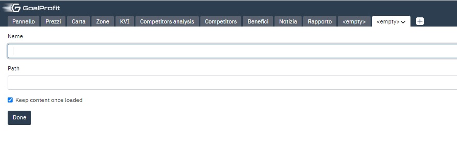
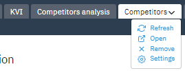
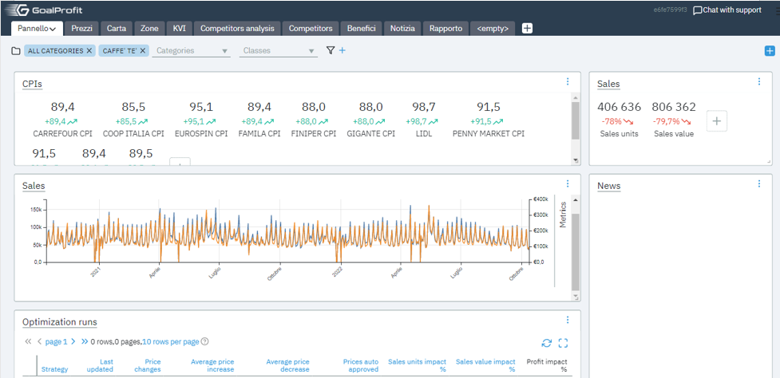
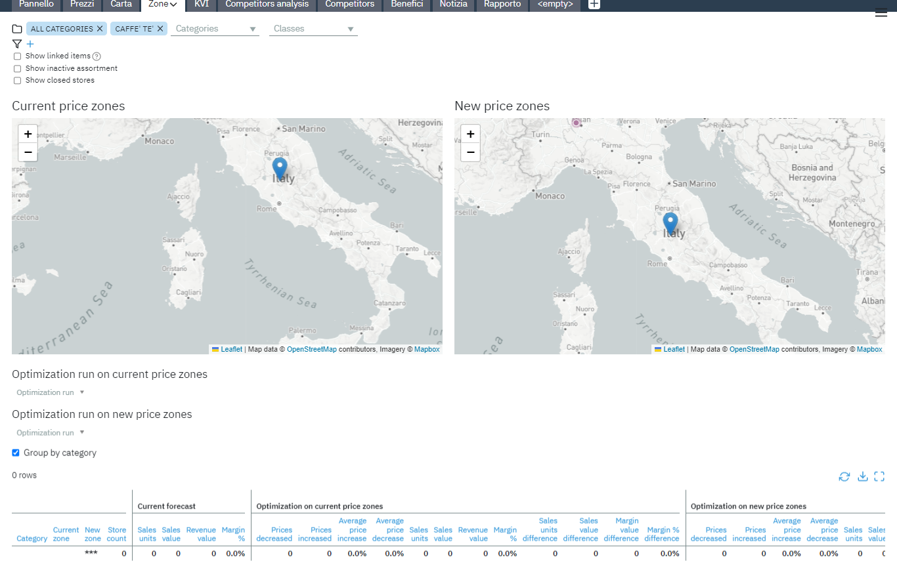
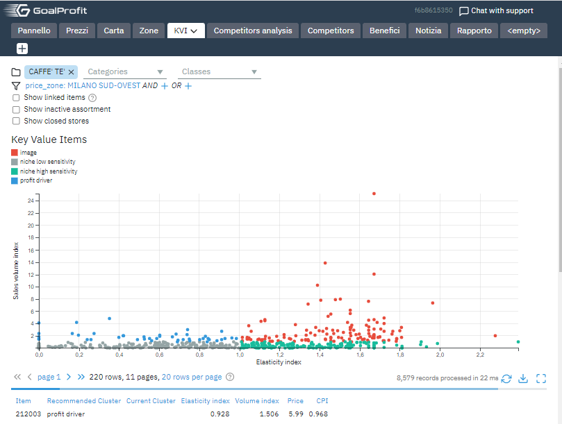
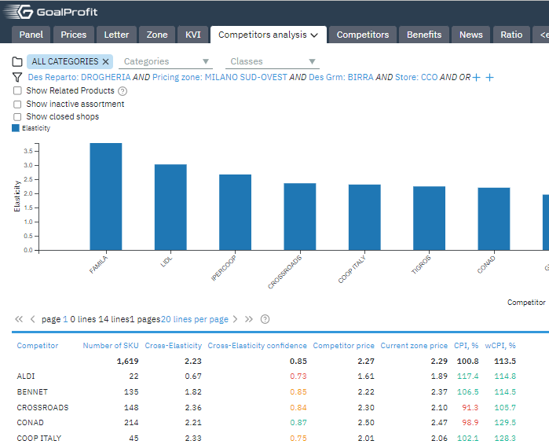
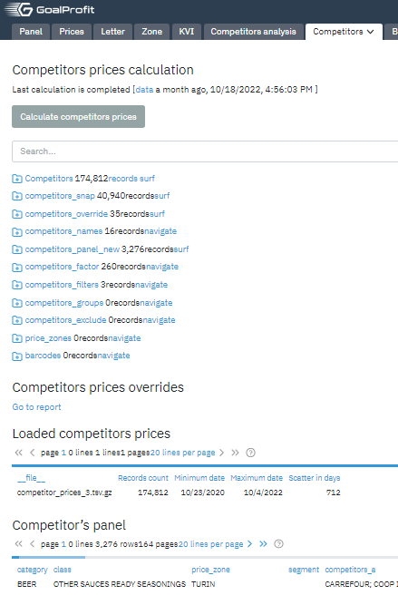

## Menu Bar: Dashboard & Map, KVI & Prices, Competitors analysis & Reports

### Glossary

* [Dashboard](#dashboard)
* [Map](#map)
* [KVI](#kvi)
* [Competitor Analysis](#competitor-analysis)
* [Competitors](#competitors)

Menu bar contains pages the client has configured to be in quick access.
To add a new page, press the "+" sign on the right, which should create
\<empty\> page. Give it a name and provide the path to the page.

## Dashboard

A dashboard is a visual display of all of your data. Although its usage
and function vary from client to client, its primary intention is to
provide information at-a-glance, such as KPIs. The client can modify
content to represent data relevant to them.

## Map

 

Example of a Map page displaying the Current price zone. Retailer's
transactional data combined with geospatial analytics and competitor
price shops can help understand local customer preferences; price
sensitivities; and product affinities across stores, categories, and
products, thus creating custom "price zones" based on that data.

## KVI

Key value items are often responsible for increased customer engagement,
loyalty, and profit. KVI is essential for creating a winning pricing
strategy since they are core products for retailers to set prices.

## Competitor Analysis

Researching major competitors to gain insight is possible via custom
graphs displaying data like price elasticity & through monitoring
numbers like current zone price/Consumer price index. Competitor
analysis provides both an offensive and defensive strategic context to
identify opportunities and threats
 

## Competitors

The calculation of the competitor prices is performed on this page.
