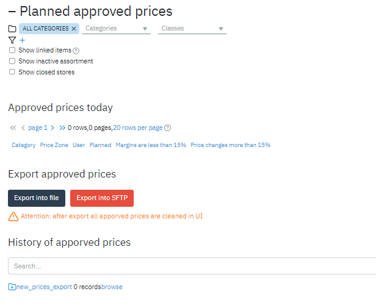
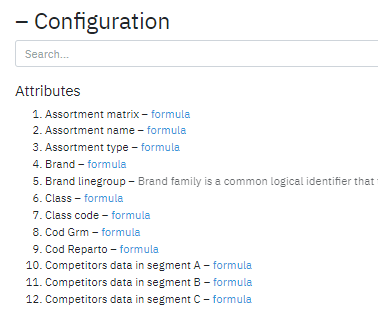

## Additional pages

#### new_price_count page

This page displays the number of planned price changes. By default, the
page can be found at
**https:///hostname.goalprofit.com/pages/new_price_count/**.

It also contains the data upload module. This module is responsible for
exporting data from the system. The following options are available:

-   Export to file - export data in txt format. The file name has the
     following mask: \_\<today\'s date in YYYYMMDD format\>.txt

-   Export to SFTP - export data to the sftp server.

A script is launched that generates a POST request /export_prices to the
Retail microservice. This request to Retail is open and can be executed
from the outside, by a script, according to a schedule, and so on. The
parameters of the name of the uploaded file, its attribute composition
and the SFTP server are written inside the Retail microservice.

#### config page

This page contains a list of attributes and metrics. Located at
**https:///hostname.goalprofit.com/pages/config**
