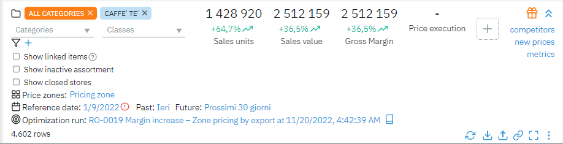
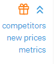
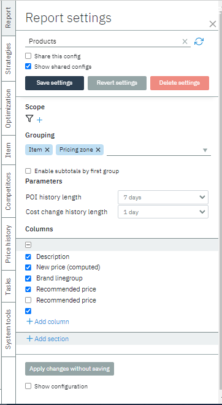
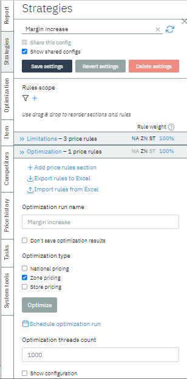
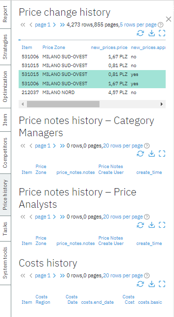
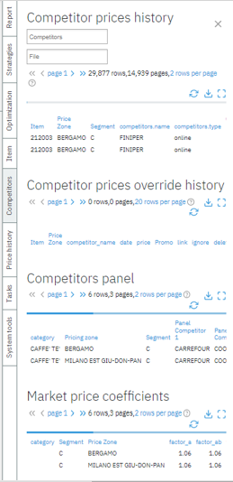
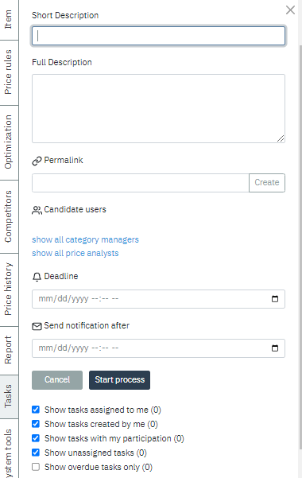
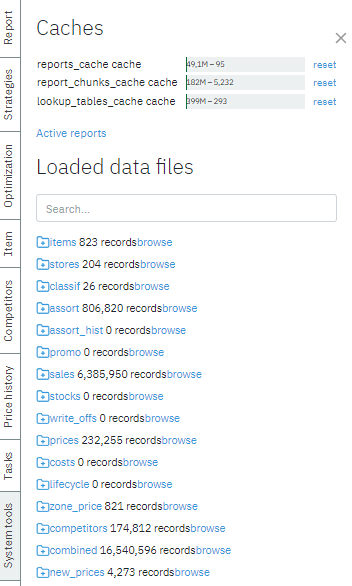

### Glossary

* [Main Panel](#main-panel)
* [Side Bar](#sidebar)

## Main Panel

The main panel displays price recommendations. In addition, the user can
select a category, class, price zone, and date as a filter zone.

The buttons at the top right minimize the main panel and lead to
additional pages:

-    - News

-   Competitors - Competitors' page;
     *https://hostname.goalprofit.com/pages/competitors*

-   New prices - pages with approved prices and price tag new_price_count feature changes;
    > *https://hostname.goalprofit.com/pages/new_price_count*

-   Metrics - list of config attributes and metrics
 *https://hostname.goalprofit.com/pages/config*

The buttons on the bottom right control the price recommendations:

-   Page update

-   Upload to excel spreadsheet

-   Loading excel spreadsheet

-   Permalink to the current set of recommendations

-   Full-screen mode

By clicking "⠇", additional options will be available:

-   Accept all recommendations

-   Accept all recommendations that do not violate strict rules

-   Accept your price changes

-   Delete all your price changes

-   Erase all new price values

## Sidebar

Sidebar host tabs such as Strategies, Optimization, Reports, History,
etc.

The preconfigured tabs are Reports, Strategies & Optimization. The rest
are custom-made for the client to suit their needs.

### Reports

This tab generates a report for the user

The report governs the data being displayed in the content table, such
as columns included in the report or grouping method used.

Reports can be saved as configuration. By clicking "Show shared config",
you will be able to view configurations done by other users if they have
checked the box "Share this config" when they save the settings. Reports
are stored at */inbox/storage/strategies*

For more information about creating reports, check this
[[LINK]{.underline}](https://docs.google.com/document/d/162M5RdEL7OIshMjnTpqE2itRJqGQIk3AVhi4Saj0-PE/edit?usp=sharing).

### Strategies

This tab is a constructor of price and optimization rules.

The user can select rules from the list and configure its parameters.
The configuration is written to a file in the /inbox/storage/strategies
folder.

For more information about pricing rules and strategies, check this
[[LINK]{.underline}](https://docs.google.com/document/d/162M5RdEL7OIshMjnTpqE2itRJqGQIk3AVhi4Saj0-PE/edit?usp=sharing).

**Optimization**

### Custom Tab: History

This tab shows the history of price changes and price notes. As a custom
user-created tab, it can incorporate particular requests & data, such as
Cost history or Price notes history done by either category managers or
price analysts.

This tab contains information about all price changes executed by the
system.

*gp-section-history* is responsible for the work of this tab. These
tables have *combined* stream as their source.

### Custom Tab: Competitor prices

This tab contains information about competitors.

This tab includes segments such as Competitor prices override history,
Competitor panel, and market price coefficients.

Competitors are a table that has ***combined*** as a source.

### Custom Tab: Task

In this tab, you can create a task for yourself or other users.

### Custom Tab: Data

This tab contains all data written to the system. The table below shows
when and what data was loaded.

