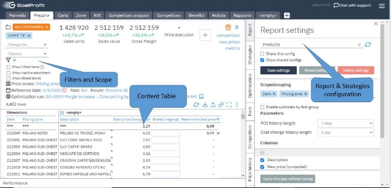

# **Getting Started Guide**
---
**GoalProfit** is the platform for the rapid development of reliable business applications: a high-performance, in-memory MPP (Massively Parallel Processing) database specifically designed for analytics. 

From business-critical data applications to advanced analytics, GoalProfit helps you analyze large volumes of data faster than ever before, helping you to accelerate your reporting, build intelligence applications, and to turn data into value.

In this documentation, you will find all the information you need to effectively use our pricing management & optimization tool.

Whether you are just getting started with our pricing tool or are an experienced user, this guide will provide you with all the information you need to get the most out of the tool. We have included step-by-step instructions, helpful tips, and resources to help you make informed pricing decisions for your business.

## Glossary
---
* [Main Panel](panel/)
* [Menu Bar: Dashboard & Map, KVI & Prices, Competitors analysis & Reports](menu/)
* [Additional pages](pages/)
---

## About GoalProfit Applications

GoalProfit is designed to automate pricing, making recommendations based on price rules, competitor prices, forecasts, and elasticity. 
This guide provides a basic introduction to the GoalProfit platform and its components.

Our pricing tool is designed to help businesses of all sizes accurately and easily price their products and services. With our intuitive interface and advanced features, you can quickly and confidently set the right prices for your offerings.

The service provided by GoalProfit are as follows:

* GoalProfit Price Management Software-as-a-Service 
* GoalProfit Price Optimization Software-as-a-Service
* GoalProfit Markdown Optimization Software-as-a-Service

## **When to use**

Pricing solutions enable retailers to maximize GMROI (Gross Margin Return on Investment) by setting optimal initial prices, promotions, and markdowns.

Using pricing optimization retailers get:

- Integrating planning with pricing enables a retailer to create an optimal product journey.
- Retail AI uses limitations, goals, and sales history to minimize cost and maximize profit. 

The system, developed by GoalProfit, predicts at what price items are most profitable to sell and boosts sales by analyzing demand elasticity. A low-code platform, it flexibly adjusts to users without long development cycles. To do this, the model focuses on the main demand drivers: seasonality, promotional activity, inventory levels, price elasticity of demand, and assortment rotation. The system considers the costs of store re-evaluation, more than 40 pricing rules, and competitor data.

# Contact

On the upper toolbar, you can see the logo of GoalProfit (on the left) and the contact support button on the
right.

Clicking on it opens a feedback window, where you can leave a message,
your contact information, and the permalink of the instance if
applicable:

