# User Guide

In this documentation, you will find all the information you need to effectively use our pricing management & optimization tool as a SaaS (Software as a Service) solution.
Our pricing tool is designed to help businesses of all sizes accurately and easily price their products and services. With our intuitive interface and advanced features, you can quickly and confidently set the right prices for your offerings.

Whether you are just getting started with our pricing tool or are an experienced user, this guide will provide you with all the information you need to get the most out of the tool. We have included step-by-step instructions, helpful tips, and resources to help you make informed pricing decisions for your business.

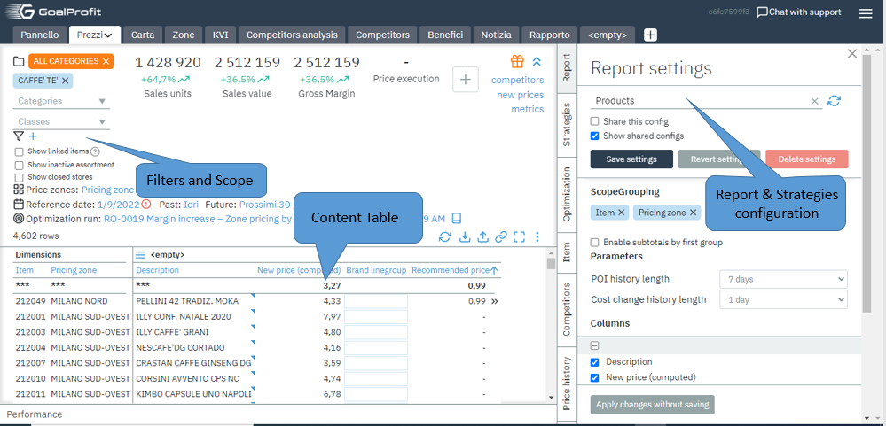

GoalProfit is designed to automate pricing, making recommendations based
on price rules, competitor prices, forecasts, and elasticity. This guide
provides a basic introduction to the GoalProfit platform and its
components.

On the upper toolbar, you can see the
logos of GoalProfit (on the left) and the contact support button on the
right.

Clicking on it opens a feedback window, where you can leave a message,
your contact information, and the permalink of the instance if
applicable:

## Main Panel

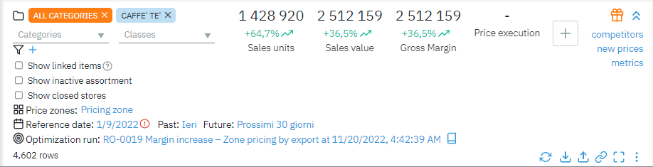

The main panel displays price recommendations. In addition, the user can
select a category, class, price zone, and date as a filter zone.

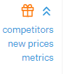

The buttons at the top right minimize the main panel and lead to
additional pages:

-    - News

-   Competitors - Competitors' page;
     *https://hostname.goalprofit.com/pages/competitors*

-   New prices - pages with approved prices and price tag new_price_count feature changes;
    > *https://hostname.goalprofit.com/pages/new_price_count*

-   Metrics - list of config attributes and metrics
 *https://hostname.goalprofit.com/pages/config*

The buttons on the bottom right control the price recommendations:

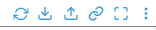

-   Page update

-   Upload to excel spreadsheet

-   Loading excel spreadsheet

-   Permalink to the current set of recommendations

-   Full-screen mode

By clicking "⠇", additional options will be available:

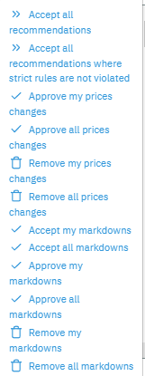
-   Accept all recommendations

-   Accept all recommendations that do not violate strict rules

-   Accept your price changes

-   Delete all your price changes

-   Erase all new price values

## Sidebar

Sidebar host tabs such as Strategies, Optimization, Reports, History,
etc.

The preconfigured tabs are Reports, Strategies & Optimization. The rest
are custom-made for the client to suit their needs.

### Reports

This tab generates a report for the user

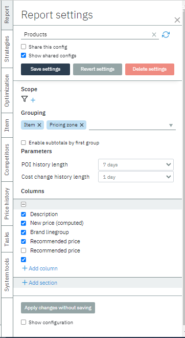

The report governs the data being displayed in the content table, such
as columns included in the report or grouping method used.

Reports can be saved as configuration. By clicking "Show shared config",
you will be able to view configurations done by other users if they have
checked the box "Share this config" when they save the settings. Reports
are stored at */inbox/storage/strategies*

For more information about creating reports, check this
[[LINK]{.underline}](https://docs.google.com/document/d/162M5RdEL7OIshMjnTpqE2itRJqGQIk3AVhi4Saj0-PE/edit?usp=sharing).

### Strategies

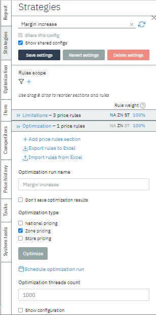

This tab is a constructor of price and optimization rules.

The user can select rules from the list and configure its parameters.
The configuration is written to a file in the /inbox/storage/strategies
folder.

For more information about pricing rules and strategies, check this
[[LINK]{.underline}](https://docs.google.com/document/d/162M5RdEL7OIshMjnTpqE2itRJqGQIk3AVhi4Saj0-PE/edit?usp=sharing).

**Optimization**

### Custom Tab: History

This tab shows the history of price changes and price notes. As a custom
user-created tab, it can incorporate particular requests & data, such as
Cost history or Price notes history done by either category managers or
price analysts.

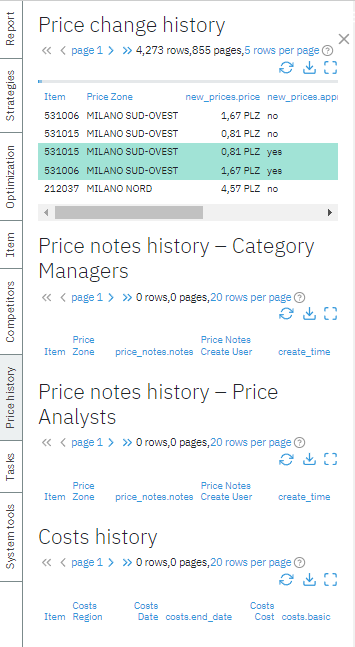

This tab contains information about all price changes executed by the
system.

*gp-section-history* is responsible for the work of this tab. These
tables have *combined* stream as their source.

### Custom Tab: Competitor prices

This tab contains information about competitors.

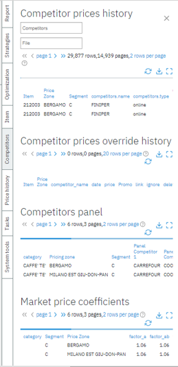

This tab includes segments such as Competitor prices override history,
Competitor panel, and market price coefficients.

Competitors are a table that has ***combined*** as a source.

### Custom Tab: Task

In this tab, you can create a task for yourself or other users.

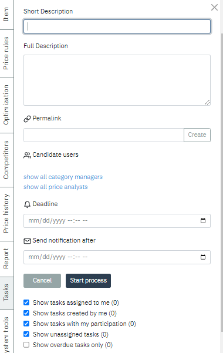

### Custom Tab: Data

This tab contains all data written to the system. The table below shows
when and what data was loaded.

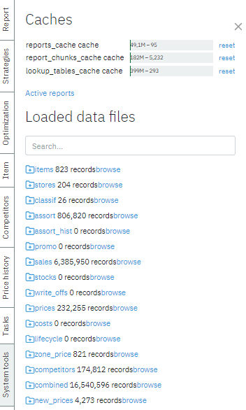

##  

## Menu Bar: Dashboard & Map, KVI & Prices, Competitors analysis & Reports

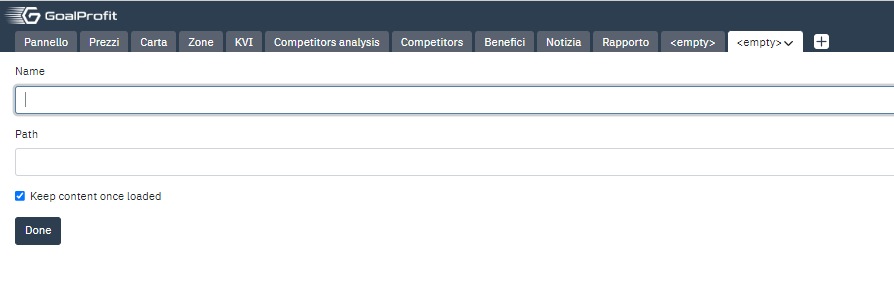

Menu bar contains pages the client has configured to be in quick access.
To add a new page, press the "+" sign on the right, which should create
\<empty\> page. Give it a name and provide the path to the page.

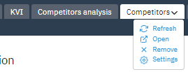
### Dashboard

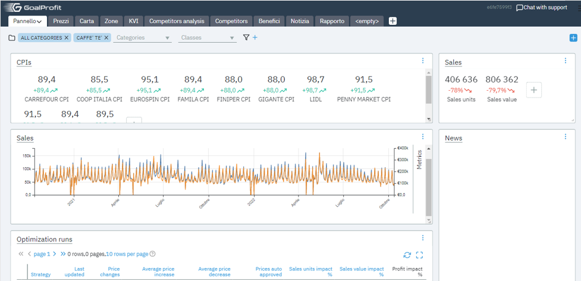

A dashboard is a visual display of all of your data. Although its usage
and function vary from client to client, its primary intention is to
provide information at-a-glance, such as KPIs. The client can modify
content to represent data relevant to them.

### Map

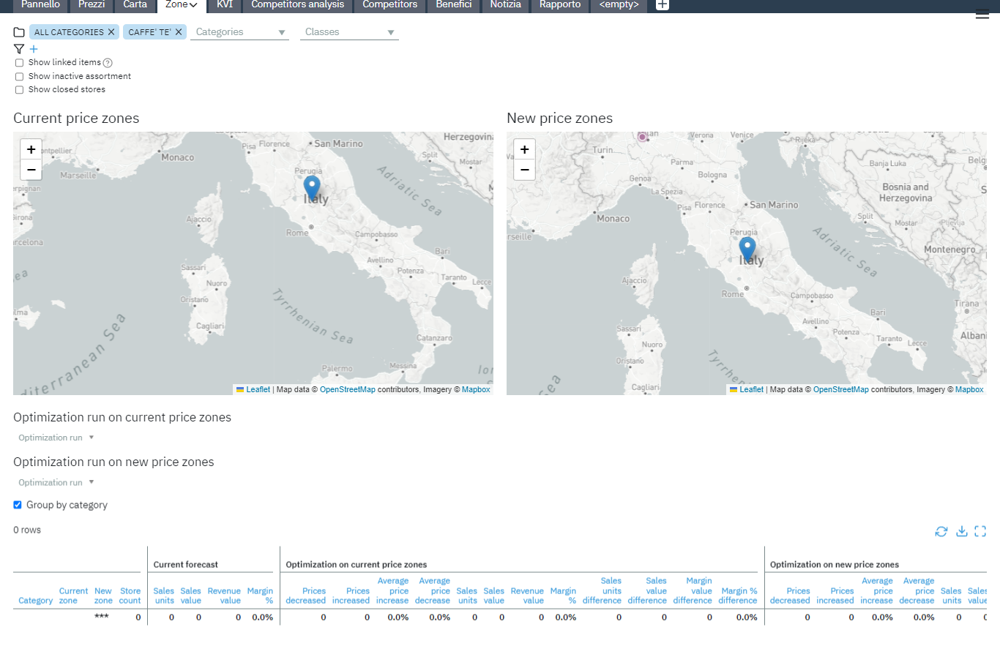

Example of a Map page displaying the Current price zone. Retailer's
transactional data combined with geospatial analytics and competitor
price shops can help understand local customer preferences; price
sensitivities; and product affinities across stores, categories, and
products, thus creating custom "price zones" based on that data.

### KVI

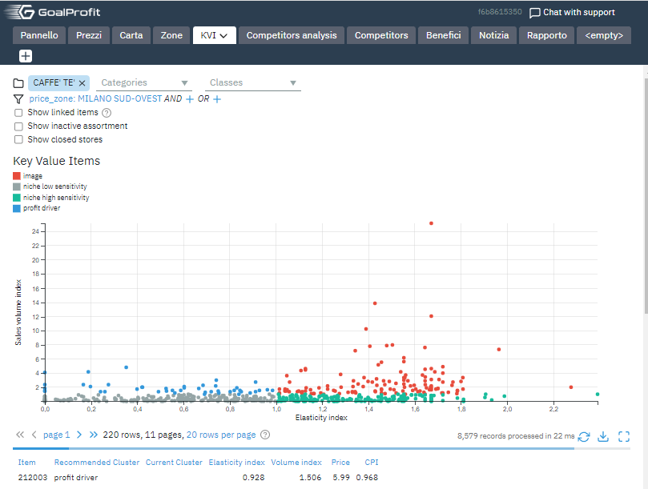

Key value items are often responsible for increased customer engagement,
loyalty, and profit. KVI is essential for creating a winning pricing
strategy since they are core products for retailers to set prices.

### Competitor analysis

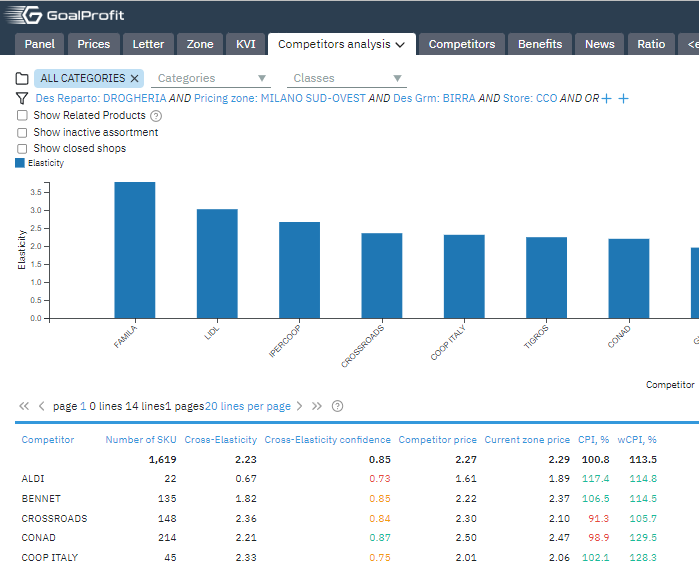

Researching major competitors to gain insight is possible via custom
graphs displaying data like price elasticity & through monitoring
numbers like current zone price/Consumer price index. Competitor
analysis provides both an offensive and defensive strategic context to
identify opportunities and threats

###  

### Competitors

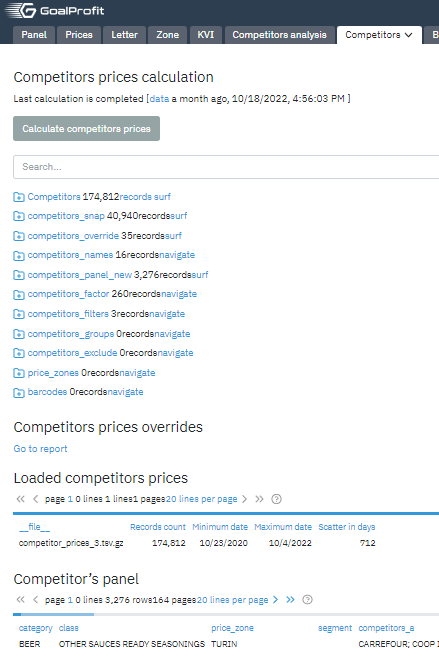

The calculation of the competitor prices is performed on this page.

### Additional pages

#### new_price_count page

This page displays the number of planned price changes. By default, the
page can be found at
**https:///hostname.goalprofit.com/pages/new_price_count/**.

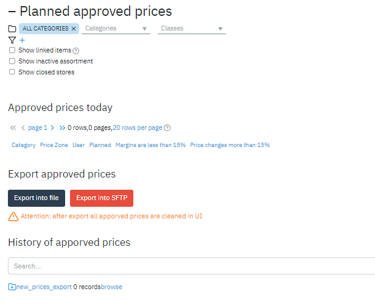

It also contains the data upload module. This module is responsible for
exporting data from the system. The following options are available:

-   Export to file - export data in txt format. The file name has the
     following mask: \_\<today\'s date in YYYYMMDD format\>.txt

-   Export to SFTP - export data to the sftp server.

A script is launched that generates a POST request /export_prices to the
Retail microservice. This request to Retail is open and can be executed
from the outside, by a script, according to a schedule, and so on. The
parameters of the name of the uploaded file, its attribute composition
and the SFTP server are written inside the Retail microservice.

#### config page

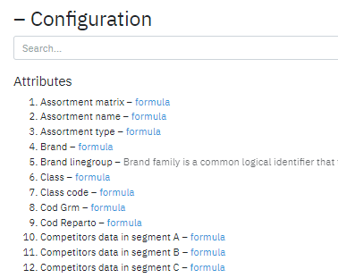

This page contains a list of attributes and metrics. Located at
**https:///hostname.goalprofit.com/pages/config**
