# Optimization Process
### Glossary

* [Reports](#reports)
* [Strategies](#strategies)
* [Types of rules](#types-of-rules)

---

The platform allows you to generate optimal prices for products using
pricing rules, which adjust and set prices based on several determining
factors or restrictions.

To start the optimization, define the scope first - a list of items
whose price will be optimized.

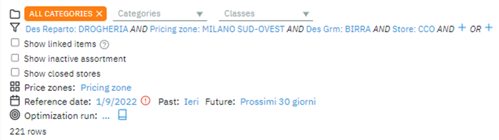 

Scope includes:

-   List of categories & classes

-   Global filter

-   Filter inside strategies (report)

**A product category** is a group of similar products that share related
characteristics.

**A product class** is a group of homogeneous products that are
generally considered substitutes for each other.

The client himself determines these product categories and classes and
sets the hierarchy of items accordingly.

**Filtering** allows scoping the product searches based on multiple
attributes like brand, pricing zones, store, class, size group, etc.

**The scope** within the report does the same thing as the main global
filter, except its settings and configuration can be saved inside the
report for later usage.

# Reports

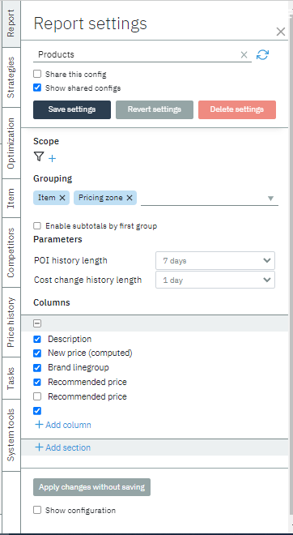

The report displays data like you requested: grouping through specified
attributes, showing the requested column, and through a specified scope.
You can create a new report or choose an existing one.

The scope, all grouping attributes, and selected columns can be saved as
configuration. By clicking "*Show shared config*", you will be able to
view other configurations done by other users if they have checked the
box "*Share this config*" when they save the settings.

Select existing report

-   My reports

-   Shared reports

Create new report

1.  Select "*Create a new entry"* in the field "Config name" and type
     the name of the new report

2.  Add the necessary *scope* to the report

3.  Add the *groupings* according to which the data will be shown in
     working table

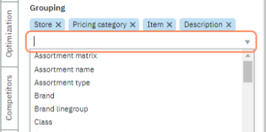

4.  Add the *columns* that represent the data you need

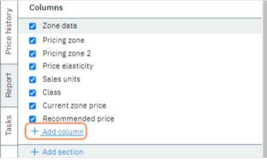

Remember to apply the changes for the content table to update the data

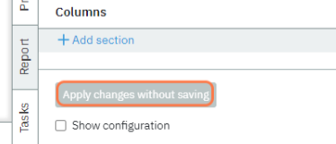

# Strategies

Strategies for price optimization can be formed in three ways:

-   Create a new strategy and add price rules,

-   Export/import rules to Excel,

-   See existing configuration in the Strategies tab

After defining the scope - a list of items whose price will be
optimized - by selecting the report or creating a new one; you can
proceed to set the price rules for those items to be optimized.

The number of rules, their scope & custom parameters can be saved as a
strategy configuration.

In the Strategies Tab, select "*Create a new entry"* in the field
"*Config name*" and type the name of the new strategy.

By clicking "*Show shared config*", you will be able to view other
strategies done by other users if they have checked the box "*Share this
config*" when they save the settings.

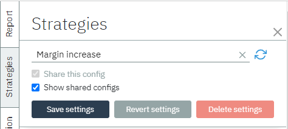

To add the price rule, create the rules section by clicking "Add price
rules section" and give it a name.

Then click "Add price rule"

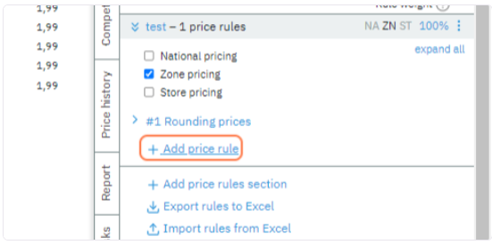

# Types of rules

Optimization consist of 2 components:

-   Optimization goal

-   Business Factors & Limitations

**Goal optimization**: every optimization strategy can have an
objective, what goal is it trying to achieve.

You can set this rule to maximize:

1.  Revenue

2.  Gross margin

3.  Sales units

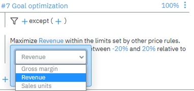

There could be multiple optimization goals present in the same strategy
and their rule weight can be set & configured accordingly.

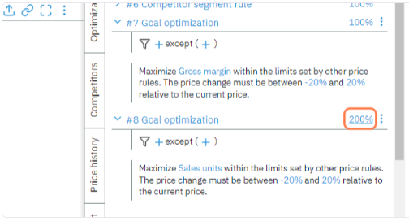

*Important!*: Optimization works only if the ***forecasting module*** is
activated and the *model parameters* are available for
products in the scope. Check the forecasting module for more info.

**Business Factors & Limitations**

Business components that affect pricing depend on many factors:

-   Market segment and number of products

-   Number of stores and countries where the network is present

-   Strategies and range of competitors

-   Seasonal demand

-   Availability of goods related to each other on any basis

-   Legal restrictions

The platform enables flexible creation of any rules in accordance with
these factors and the combination of these rules into various
strategies.

The price rule can have its scope where it applies.

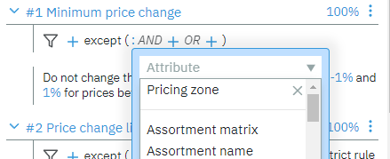

All the rule parameters can be configured.

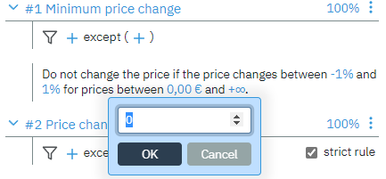

The rule name itself can be changed (by clicking "⠇") to provide a
better description.

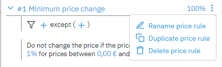

Examples of some rules:

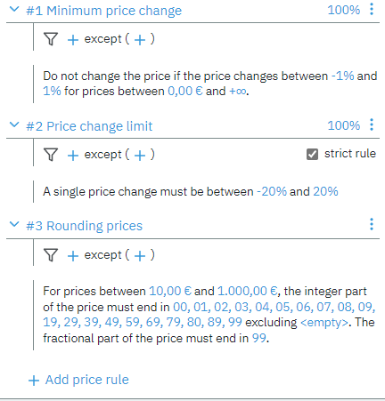

In the context of pricing, strict rules refer to a set of guidelines or policies that must be followed strictly when setting and maintaining prices for products or services. These rules are established by a company's management or by a price optimization software system based on provided business factors and limitations. The purpose of strict rules is to ensure that prices are set and adjusted in a consistent and predictable manner, and to prevent any harmful deviations or exceptions.

For example, a strict rule in pricing might dictate that prices must be adjusted every month based on changes in market conditions and competitors' prices. Another rule might require that prices be set at a certain level relative to the cost of goods sold.

There are several types of price rules. Based on them, system
administrators can create price rules for users to add to strategies and
create new custom price rules. All price rules can be categorized into
nine different types:

-   **Same price** - gives the same price to the item group in sets of
     stores. Example:

    -   **Pricing linegroup**: All products within a linegroup must have
         the same price.

    -   **Pricing zone**: Products in all stores within the price zone
         must have the same price.

-   **Price change**: gives the range within which the price change
     should occur. Example:

    -   **Price change limit**: Relative to the current *zone price*.
         Can be a strict rule.

    -   **Min margin**: Sets target *margin* range in percentage.

    -   **Price regulation**: Range relative to a special attribute,
         like alcohol or tobacco regulations. Can be a strict rule.

    -   **Competitor segment**: Keep the price relative to the selected
         competitor segment: *direct competitor, online, direct +
         online*. Can be a strict rule.

    -   **Cost update**: Keep the markup if the purchase price has
         changed from yesterday to today. A price variation from
         *{min}* to *{max}* is allowed. Can be a strict rule.

    -   **CPI**: Sets target CPI range in percentage.

-   **Products relationship**: defines relations between certain item
     groups and how their prices are correlated. The price deviation
    should not exceed the range given in percentage. Example:

    -   **Brand**: Brand A should be relative to Brand B in a specified
         range of price deviation

    -   **Size**: correlation by size and equivalent price per kg/l/oz

    -   **Cross-zone**: correlation by prize zones

    -   **Competitors**: relative to competitors\' pricing in the
         market.

-   **Fixed Price**: ignore price recommendation in favor of this rule.
     Example:

    -   **New price**: new price overrides recommendations

    -   **Fixed price**: do not change if fixed price flag is set

    -   **Promo lock**: item is on promo do not change the price

-   **Minimum price change**: the rule doesn't change the price if the
     price changes are between specified threshold

-   **Rounding**: adjust the price to be ending with .99 or .00 for
     prices in certain range

-   **Minimal optimization effect, Limit recommendation** - only if goal
     optimization is present

##### Read more about [Pricing rules and how they work](../rules).
